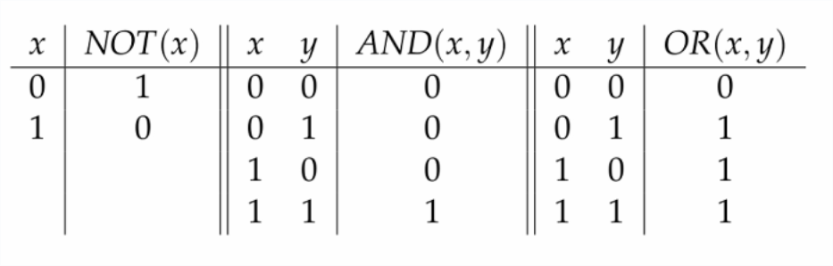
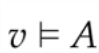
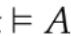
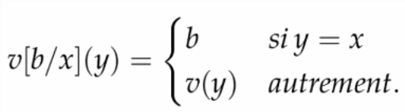
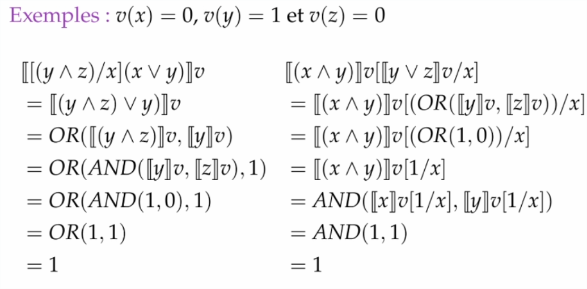
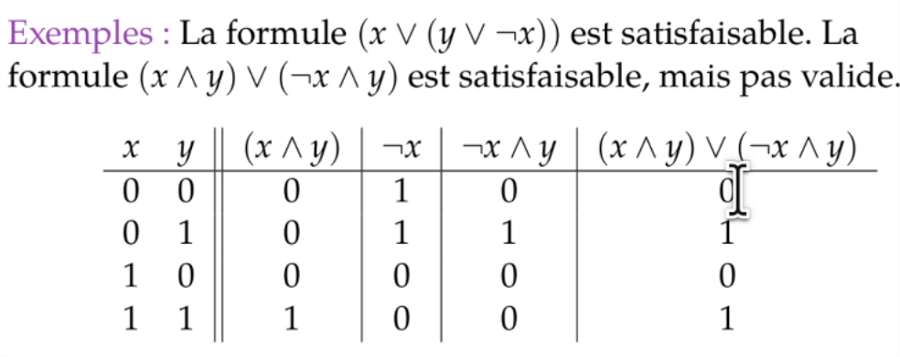

20210228183127
#l2
#ol4
#logic

# OL4 CMTD 3

**Ressources** : 
- pdf cours 3
- 3 vidéos :
    - Syntaxe du calcul propositionnel (3'40)
    - Sémantique du calcul propositionnel (7'40)
    - Validité, satifaisabilité et équivalence logique (3'40)
    
## Syntaxe du calcul propositionnel

La **syntaxe** du calcul propositionnel est l'**algèbre initiale** (notée T sigma) sur la signature **V union {négation¹, et², ou²}** (où V est l'ensemble des variables : x, y, z, a, b, c, ...).

Les éléments de cette algèble initiale sont appelés **formules**. 
Pour ne pas confondre variables et formules, on écrit le nom des formules en majuscule (A, B, C, ...)

Un **littéral** est une formule qui est une variable ou la négation d'une variable (ex : x; non y). On les note par la lettre L en minuscule.

Quelques opérateurs utilisés souvent :
- implication : **(A -> B) = (non A ou B)**
- ssi : **(A ↔ B) = ((A -> B) et (B -> A))**
- ou exclusif : **(A croix dans un rond B) = ((A et non B) ou (non A et B))**
- conditionnel : **(A flèche ondulée B, C) = ((A et B) ou (non A et C))**

## Sémantique du calcul propositionnel

### Interprétation standard

L'**interprétation** d'une formule A par rapport à une affectation v  (de V dans B = qui associe une valeur booléenne à chauqe variable) est **la fonction unique [[]]v** qui est déterminée par v, AND, OR et NOT, tel que :
- *[[x]]v = v(x)* c'est-à-dire la valeur booléenne de x
- *[[non A]]v = NOT([[A]]v)*
- *[[A et B]]v = AND([[A]]v, [[B]]v)*
- *[[A ou B]]v = OR([[A]]v, [[B]]v)*

Tables de vérité de NOT, AND et OR : 

 Exemple : 

 

### Notations
-  = **A est satifait par V** si **[[A]]v = 1**

-  = **A est valide** si pour tout v, [[A]]v = 1, c'est-à-dire que **A est satisfait quelques soient les valeurs des variables**

- **Mise à jour** :
 
(on remplace x par b)

Lien entre substitution et mise à jour : 
(c'est-à-dire qu'on peut soit d'abord remplacer les variables et après calculer la valeur booléenne du tout, soit directement remplacer la variable par la valeur booléenne de la nouvelle variable)

## Validité, satifaisabilité et équivalence logique

### Validité

**A est valide (ou une tautologie)** si , c'est-à-dire si A est toujours vrai. 
Pour montrer qu'une formule est valide, il faut **faire sa table de vérité** et montrer qu'elle retourne vrai quelles que soient les valeurs des variables.

### Satisfaisabilité

Une formule A est **satisfaisable** si il existe une affectation v telle que **v satifsait A** (si il existe des valeurs pour les variables tel que A est vraie, donc pas besoin de calculer la table de vérité forcément, même si ça peut aider à trouver les valeurs).

### Equivalence logique entre 2 formules

Pour montrer que deux formules sont équivalentes, on peut regarder si elles ont les mêmes tables de vérité.