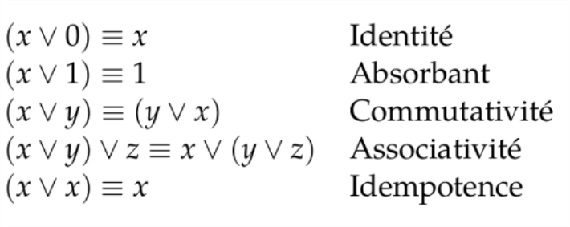
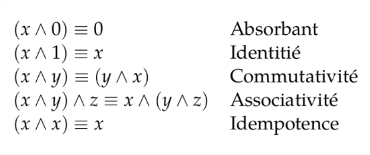

20210228191353
#l2
#ol4
#logic

# OL4 CMTD 4 : Equivalence logique et forme normale

**Ressources :
- pdf cours 4
- 3 vidéos :
    - Equivalence logique (7'30)
    - Fonction définissable
    - Forme normale (7'20)

## Equivalence logique

(notée avec un égal à 3 barres)

### Propriétés de la **disjonction** (OR) : 

### Propriétés de la **conjonction** (AND) : 

###  Distributivité

### Lois de De Morgan (distrib de NOT sur AND et OR)
(rime avec maman)

 

## Fonction définissable

## Forme normale

Idée : standardiser l'expression des formules pour pouvoir les comparer plus facilement

### Forme normale disjonctive (DNF)

On appelle **monôme** une conjonction de littéraux.
Une DNF est une formule qui est une **disjonction de monômes**

**Toute formule définissable a une DNF.**
La DNF est **unique** (car conjonction et disjonction sont associatives et commutatives). Mais elle n'est **pas forcément de taille minimale**.

_Pour construire la DNF : _
1) faire la table de vérité
2) on construit le monôme (l_1 AND l_2 AND ... AND l_n) 
      où l_i = x_i si b_i = 1
               = NOT x_i sinon 
3) la formule est la disjonction (OR) des monômes construits à l'étape 2              

_Explications pour l'étape 2 :_
- on regarde dans la colonne de la formule finale les lignes qui ont un 1. Ca correspond à x = y = 0 et x = y = 1.
- on a donc f(0,0)=1 et f(1,1)=1
- on construit les monômes qui correspondent : 
    - x=0;y=0 => (NOT x) AND (NOT y)
    - x=1;y=1 => x AND y
- finalement, on lie les deux avec un OR pour avoir la formule finale.

### Forme normale conjonctive (CNF)

On appelle **clause** la disjonction de littéraux.
Une CNF est une formule qui est une **conjonction de clauses**

**Toute fonction définissable a une CNF.**
La CNF est **unique** (car conjonction et disjonction sont associatives et commutatives). Mais elle n'est **pas forcément de taille minimale**.

Voir ex 18 pour la construction d'une CNF.