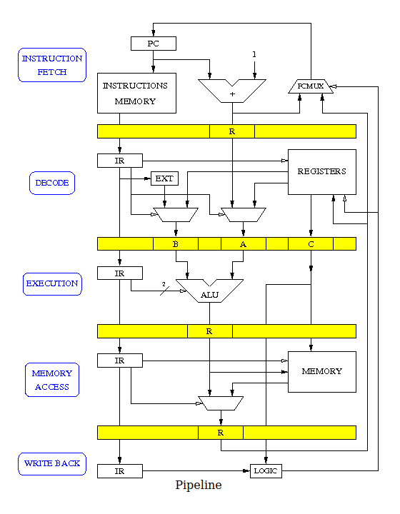

# Cours 11, pipeline

- X barrières de registres
- X+1 étages de pipeline

## IDEMW
- Instruction fetch
- Instruction decode
- Instruction execute
- Memory acces
- Write back

 Instructions | 1 | 2 | 3 | 4 | 5 | 6
---|---|---|---|---|---|---
 I1 | I | D | E | M | W |
 I2 | | I | D | E | M | W
 I3 | | | I | D | E | M
 I4 | | | | I | D | E
 I5 | | | | | I | D
 I6 | | | | | | I

## Aléas de pipeline
- structurels
- de données
- de contrôle

 Instructions | 1 | 2 | 3 | 4 | 5 | 6
---|---|---|---|---|---|---
 LDR R7, R6, 0 | I | D | E | **M** | W |
 ADD R6, R6, 1 | | I | D | E | M | W
 ADD R0, R0, 1 | | | I | D | E | M
 ADD R1, R1, 1| | | | **X** | I | D