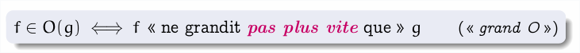
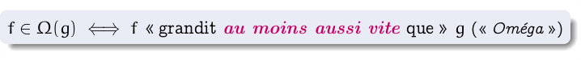
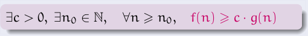
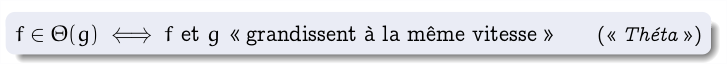
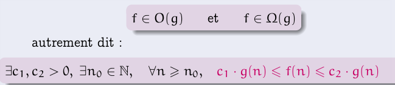

20210203134719
#l2
#ea4
#algo
Back to L2S4 index : [[20210120111811]]

# EA Amphi 2

## Complexité

### En espace

- quantité de mémoire nécessaire pour effectuer le calcul

- la **mémoire incompressible** : celle qui stocke les données et le résultat
    - on s'en fiche de celle la vu qu'on ne peut pas la réduire
    - tous les algos ont la même

- la **mémoire auxiliaire** : pour les calculs intermédiaires

## Notations

### Grand O

### Oméga

### Théta

