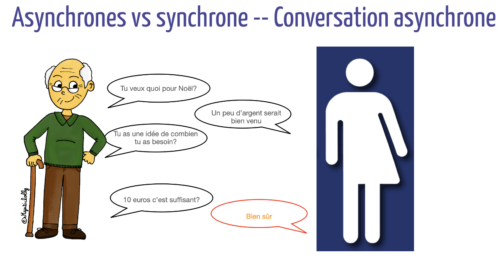

# Récapitulatif

## Cours 1

- Systèmes et algorithmes distribués (internet, cloud, réseaux sociaux, blockchain, IoT, multiprocesseurs...)
- Systèmes répartis : ensemble de noeuds qui communiquent par échange de messages
- Vocabulaire :
    - entités de calcul (noeuds, sommets... processeurs, processus...)
    - liens de communication (canaux, arêtes...) unidirectionnels ou bidirectionnels
    - ordres des messages FIFO ou non FIFO
    - mémoire des noeuds (chaque noeud a sa propre mémoire de taille potentiellement différente)
- Mémoire partagée
- Horloge (chaque noeud a son horloge potentiellement différée des autres)
- Réseau synchrone
    - temps de calculs identiques entre les noeuds
    - temps de circulation identique des messages
    - les noeuds calculent par ronde synchrone
    - dans une ronde chaque noeud : effectue des calculs locals, envoie des messages à ses voisins, reçoit des messages de ses voisins
    
- Réseau asynchrone
    - temps de calculs différents entre les noeuds
    - temps de circulation des messages non borné et fini
    
- Noeud
    - puissance de calcul 
    - possède une mémoire locale
    - possède programme local
    - possède ou pas un identifiant unique
    - connait ses liens de communication voisins
    - connait les identifiants de ses voisins
    - n'a aucune connaissance du réseau global
    - se réveillent spontanément ou suite à un événement extérieur

- Algorithme de diffusion

```
Reveil spontané du noeud i:
    val_i=identifiant_i
    Pour tout j∈Voisins_i Envoyer <Valeur,val_i> à j
Lors de la réception de <Valeur,val_j> envoyer par le noeud j
    tmp=val_i
    if val_i=null :
        val_i:=idententifiant_i
    if val_i<val_j
        val_i=val_j
    if tmp!= val_i: Pour tout j∈Voisins_i Envoyer <Valeur,val_i> à j    
```

page 59
