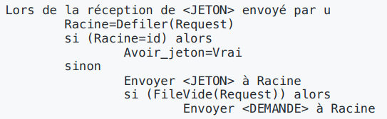

# Partage de ressources

## Protocole schématique
- Les demandes dʼaccès sont totalement asynchrones
- Pour encadrer la bonne utilisation dʼune ressource, le protocole est exécuté schématiquement de la façon suivante
```xml
<Acquisition>
<SectionCritique>
<Libération>
```

## Protocole avec jeton

- Un jeton qui circule pour garantir la sûreté de lʼaccès à la ressource
- topologie cyclique ou en anneau

### Dans un cycle

```
Acquisition 
    Demandeur_v=Vrai 
    Attendre(Avoir_jeton_v)

Liberation 
    Demandeur_v=Faux 
    Envoyer (<JETON>) à Suivant_v 
    Avoir_jeton_v=Faux

Lors de la réception de <JETON>
    Si (non Demandeur_p_) alors
        Envoyer (<JETON>) à Suivant_v
    Sinon Avoir_jeton_v=Vrai
```

**Avantages de ce protocoles :**
    - Le premier est sa simplicité
    - Il peut être étendu automatiquement
    - Ajout de noeud au système
    - Suppression de noeud dans le système
    - Aucune connaissance globale
    - Taille du message O(1) bits

**Inconvénients du protocole :**
- Longue attente, même sans autre demande
- Le jeton circule constamment, parfois pour rien
- Il nʼy a pas de priorité temporelle
- les noeuds ne sont pas forcément servi dans lʼordre des demandes

### Dans un arbre

**Explications :**

La file Request sert à ordonner les demandes de chaque sous-arbre

Si un noeud reçoit un message :
- Si sa file est vide, le noeud le transmet dans son sous-arbre dans lequel il y a le jeton
- Si sa file nʼest pas vide
    - le noeud bloque la demande à son niveau
    - le noeud débloquera la demande que lorsque les autres demande qui sont avant dans la file auront été servies.

**Avantages :**
- Le jeton circule que si il y a des demandes
- Lʼordre des demandes est plus respecté que dans lʼalgorithme sur le cycle
- Taille des messages : O(1) bits
- Nombre de messages par demande est proportionnel au diamètre de lʼarbre en moyenne O(log2n)




## Protocoles à base de permissions

### Estampillage

- Pour ces protocoles nous avons besoin dʼestampiller les message avec des marques dʼhorloge
- Rappel: aucune horloge globale nʼest disponible
- On va donc utiliser un mécanisme à base dʼestampillage basé sur les horloges logiques locale
- Ce mécanisme peut être vu comme un sous-protocole

### Estampillage protocole

variable locale ``horloge``


**Remarques :**

- Les messages sont donc transportés avec lʼheure logique à laquelle ils ont été émis
- Cependant on peut se retrouver avec deux message ayant la même estampille 
ordre partiel
- On a besoin d'un ordre total le moyen usuel dans ce cas est de prendre en compte
lʼidentifiant de lʼenvoyeur

Ainsi, à la place de considérer uniquement lʼhorloge logique, on prendra en compte le couple (h,i) où est lʼidentifiant du noeud émetteur

**Priorité :**

L'ordre sur le couple (hi, i) et (hj, j), où i et j sont les identifiants des messages, est le suivant :
- (hi, i) < (hj, j) <=> (hi < hj ou (hi = hj et i < j))

Ce qui veut dire que i est plus prioritaire que j car :
- soit la demande de i a été faite avant celle de j en prenant en compte les horloges hi et hj
- soit les horloges sont les mêmes mais l'id de i est plus petit que celui de j

### Algorithme de Ricart et Agrawala

**Principe :** Chaque noeud désirant la ressource va demander la permission à tous les autres noeuds

**Conflits :**
- on départage les conflits en utilisant les étiquettes
- chaque étiquette donne l'heure à laquelle la demande a été faite
- les demandes les plus anciennes sont prioritaires

**Variables locales :** chaque noeud maintient les variables locales suivantes :
- ``heure_demande`` : l'heure à laquelle le noeud a fait sa dernière demande
- ``rep_attendues`` : un entier comptant le nombre de réponses attendues par le noeud suite à la demande
- ``demandeur`` : un booléen qui est vrai si le noeud est demandeur et faux sinon (initialement faux)
- ``differe[j]`` : tableau de n cases booléennes, ``differe[j] = vrai`` ssi le noeud a différé sa réponse à la demande de j (initialement faux).

**Algorithme :**


**Exemple :**

- 2 et 3 sont demandeur avec une heure de demande égale à 1
- 4 est demandeur avec une heure de demande égale à 2


**Remarques :**

- La complexité est de 2(n - 1) messages par demande
- Inconvénient : une demande est faite à tous les autres noeuds, ce qui entraine un grand nombre de messages

### Algorithme de Maekawa

**Améliorations :** pour améliorer le nombre de message au lieu de demander un si grand nombre de permissions, on peut imaginer que chaque noeud i a un sous ensemble ***Si*** à qui il va demander la permission d'utiliser la ressources

**Règles :**
- Un ensemble ***Si*** sera appelé ***quorum***
- Pour être sûr que la propriété de sûreté est vérifiée, il faut que les quorums vérifient la propriété suivante : si i != j alors ***Si*** ∩ ***Sj*** != ∅
- **Règle d'intersection :**
    - pour assurer que lorsque deux noeuds i et j demandent les permissions pour entrer en section critique, les noeuds qui sont à la fois dans ***Si*** et ***Sj*** ne peuvent pas accorder la permission aux deux.
    - ainsi en cas de demandes simultanées au moins un des noeuds n'aura pas une permission
    - l'estampillage reste obligatoire pour départager les demandes multiples