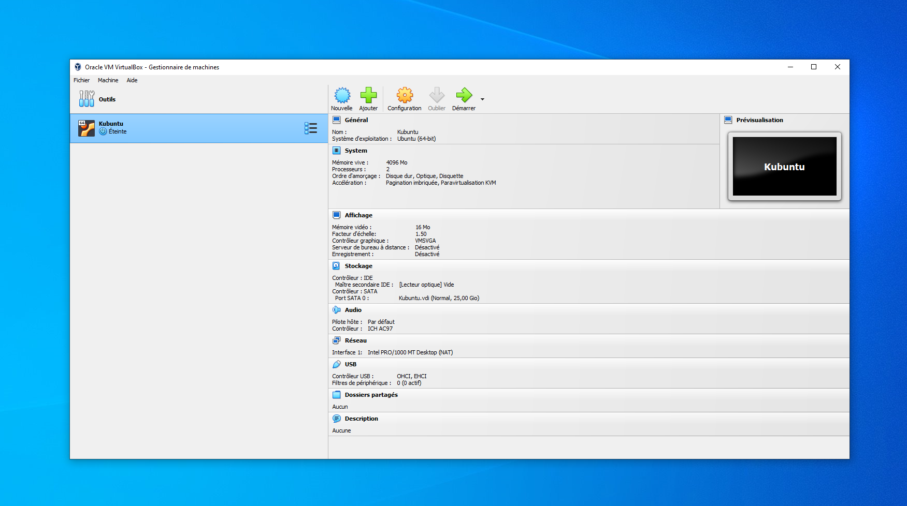
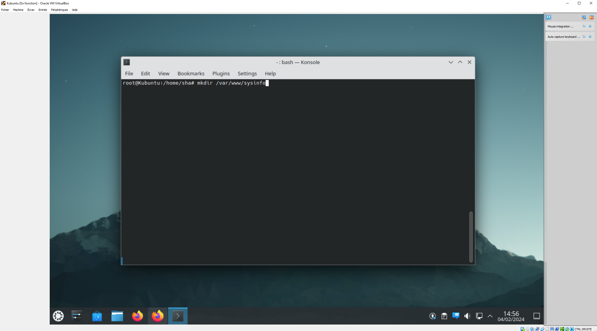
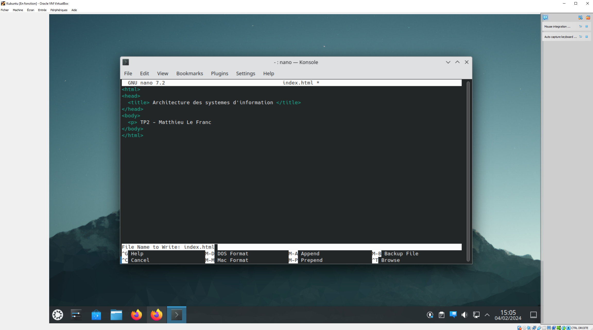
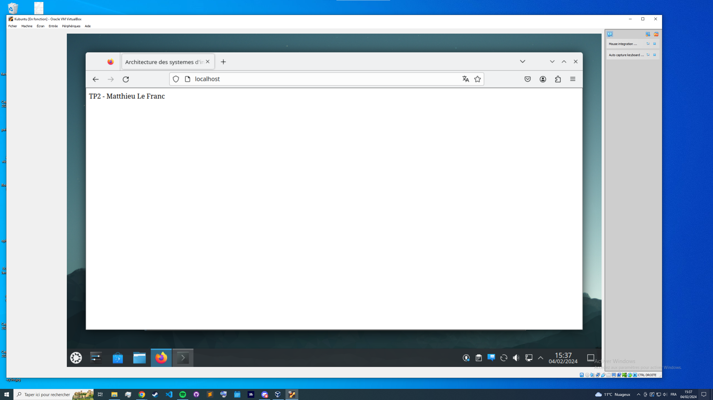
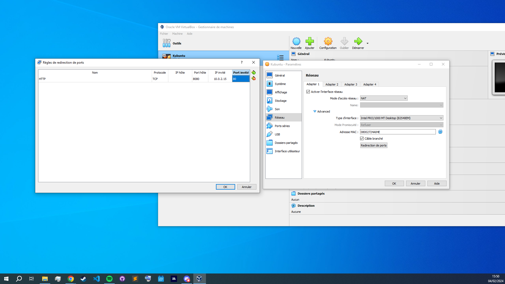
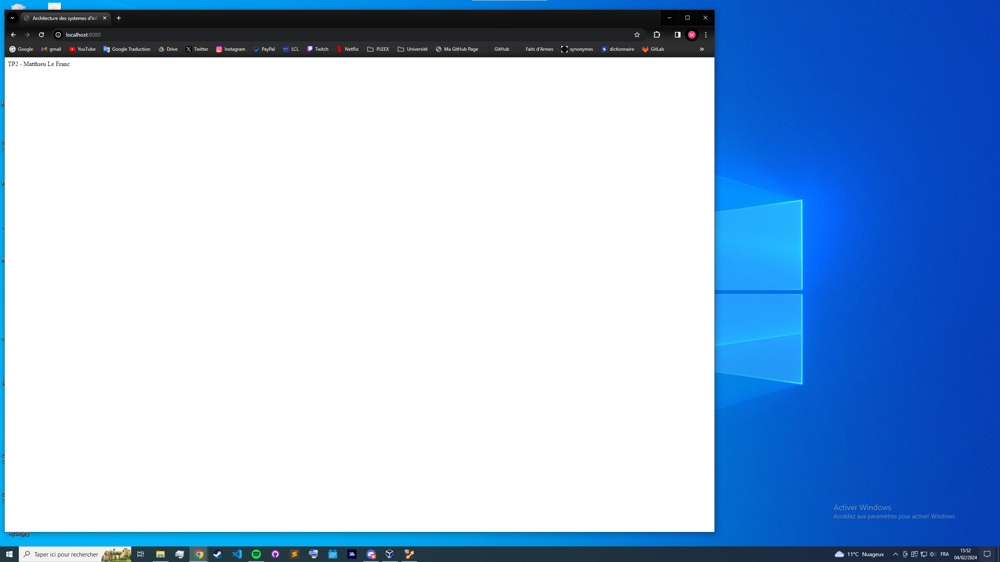

**TP n°2 V n°1**

**Titre du TP :** Virtual Machine Apache

**Date :** 04/02/2024

**Nom :** Le Franc

**Prénom :** Matthieu

**N° étudiant :** 71800858

**email :** matthieu.le-franc@etu.u-paris.fr

## Explications

J'ai réutilisé la configuration de la VM mise en place au TP1

Après avoir lancé la VM, on s'occupe d'installer apache

Ensuite on crée un répertoire pour le site web

Maintenant, on crée dans ce répertoire un fichier index.html et on y ajoute le code

Après avoir effectué quelques étapes supplémentaires de configuration, on lance le serveur apache et on peut accéder localement au site web depuis la VM à l'adresse `http://localhost:8080`

A ce moment, la page n'est pas accessible depuis la machine hôte, on doit donc effectuer une redirection de port dans la configuration de la VM.

L'ip local de la VM est `10.0.2.15` et le port par défaut d'apache est `80`, on redirige donc le port `8080` de la machine hôte vers le port `80` de la VM.

Désormais, en relançant la machine et le serveur, on peut accèder à la page depuis la machine hôte à l'adresse `http://localhost:8080`

