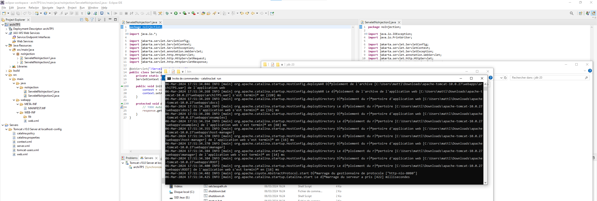

**TP n°5 V n°1**

**Titre du TP :** Virtual Machine Apache Tomcat Servelet Context communication

**Date :** 06/03/2024

**Nom :** Le Franc

**Prénom :** Matthieu

**N° étudiant :** 71800858

**email :** matthieu.le-franc@etu.u-paris.fr

## Explications

On commence par créer un nouveau projet dynamic avec sa version de tomcat

On crée deux nouveau servelet qui communiqueront entre eux, d'abord sans injection. Je commence par cette méthode car plus simple à mettre en place et à comprendre pour une première approche.

On export le projet en .war et on le dépose dans le dossier webapps de tomcat. 

On peut maintenant déployer avec ``catalina.bat run`` (j'effectue ce tp sous windows)

Voici le rendu des deux pages

