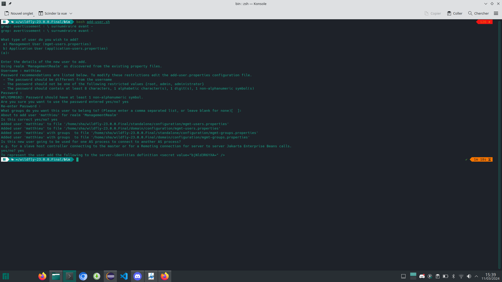

**TP n°6 V n°2**

**Titre du TP :** Servlet Context Listener

**Date :** 11/03/2024

**Nom :** Le Franc

**Prénom :** Matthieu

**N° étudiant :** 71800858

**email :** matthieu.le-franc@etu.u-paris.fr

## Explications

N'ayant pas pleinement compris le TP précédent (tp5) avec les injections, je n'avais pas réalisé la partie avec wildfly. J'ai donc créé un nouveau projet pour le tp de cette semaine où j'ai pu mettre en place wildfly et le ContextListener.

On commence donc par installer JBoss sur eclipse web pour avoir accès à wildfly.

Ensuite on crée un nouveau projet web dynamique avec wildfly comme Target runtime.

Maintenant on peut créer un servlet context listener. On crée une nouvelle classe qui implémente notamment ServletContextListener et on implémente quelques méthodes intéressantes.

On peut ensuite créer un Servlet qui va utiliser le context listener.

J'ajoute un fichier ``beans.xml`` dans le dossier ``WEB-INF`` pour activer CDI (Context and Dependency Injection) qui permet de gérer les dépendances et que ce soit déployable.

Maintenant on peut lancer le serveur wildfly. On voit que le serveur se lance bien mais qu'il nous reste à exécuter le script ``add-user.sh`` pour ajouter un utilisateur.

On exécute donc le script et on ajoute un utilisateur.

Maintenant en relançant le serveur et en allant à l'url ``/archiTP6/MonServlet`` on voit que le context listener a bien été appelé.

Voici le diagramme de séquence de l'implémentation du context listener.

