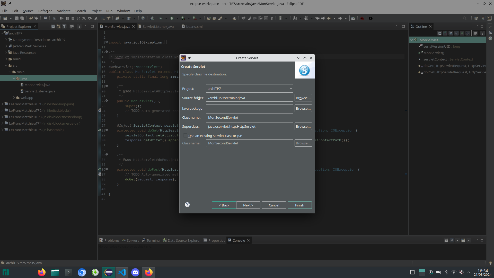
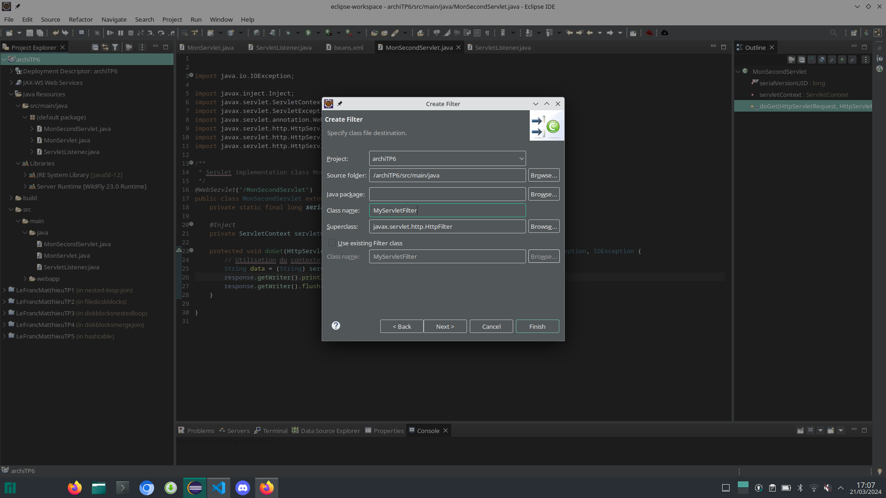
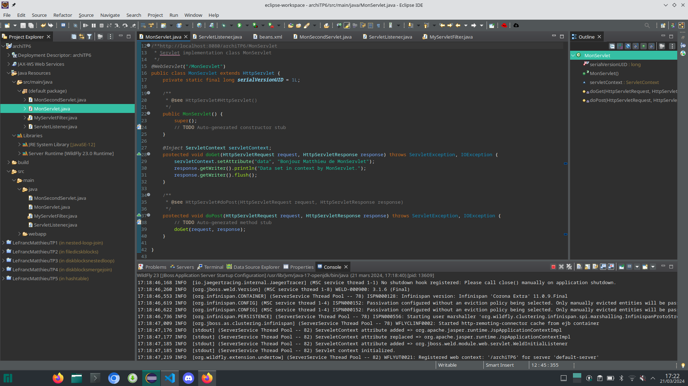
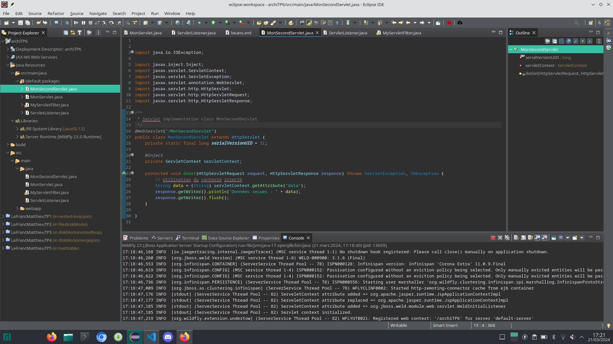
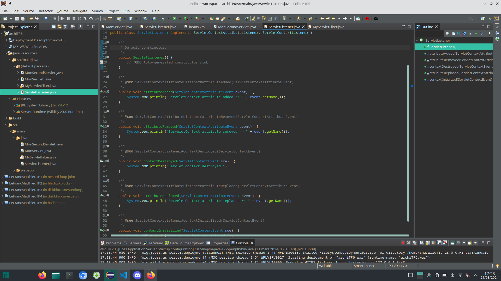
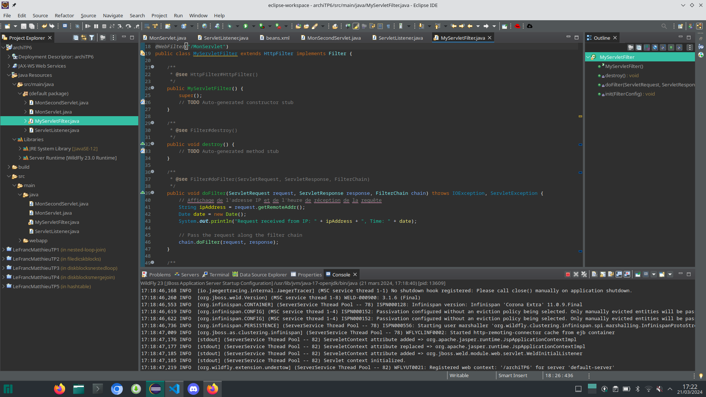
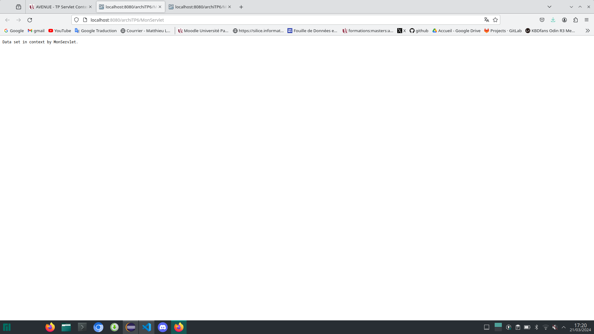
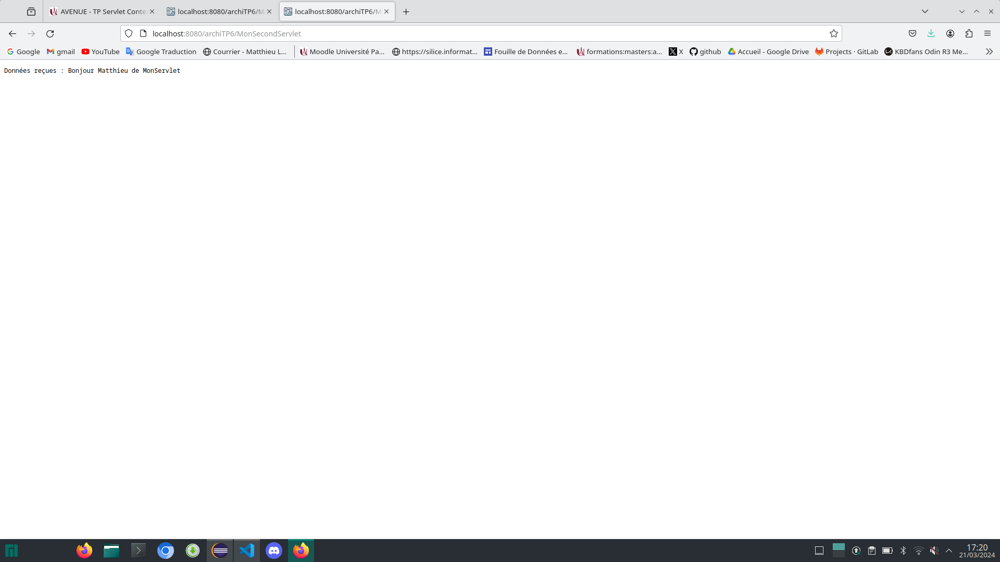

**TP n°7 V n°1**

**Titre du TP :** Servlet Context Listener Filter CDI

**Date :** 21/03/2024

**Nom :** Le Franc

**Prénom :** Matthieu

**N° étudiant :** 71800858

**email :** matthieu.le-franc@etu.u-paris.fr

## Explications

Pour le TP de cette semaine, j'ai repris le TP6 sur Servlet Context Listener. N'ayant pas, dans la version du TP6, ajouté la communication entre Servlet, j'ai également refait cette partie. On crée donc un deuxième Servlet (en plus de celui du TP6).

On crée également le Filter nécessaire. Tout se crée assez facilement grâce à éclipse web project donc comme pour les autres composants, on crée la class grâce à l'interface graphique.

Maintenant, on écrit le code des Servlet pour qu'ils communiquent entre eux et affichent les informations que l'on souhaite.

**Premier Servlet**

**Second Servlet**

On écrit aussi l'implémentation des méthodes du Listener que nous avions déjà créé au TP précédent.

Maintenant on ajoute du code au filter. On ajoute l'anotation @WebFilter avec comme attribut le pattern de l'url que l'on souhaite filtrer.
On implémente la méthode doFilter() où on récupère l'adresse ip de ServletRequest, la date et on affiche tout ça dans la sortie standard.

Désormais, on peut lancer le serveur Wildfly et voir que tout fonctionne correctement, ci-dessous les affichages dans la console.

Ci-dessous les affichages des Servlets dans le navigateur.

**Premier Servlet**

**Second Servlet**

## Rappels des précédents TPs

Je ne l'ai pas abordé ici mais j'ai également ajouté un fichier ``beans.xml`` dans le dossier ``WEB-INF`` pour activer CDI (Context and Dependency Injection). J'avais fait ceci dans le TP6 pour que ce soit déployable.