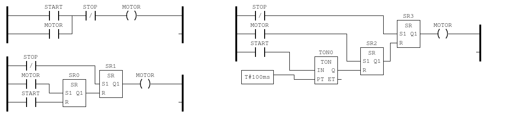

*Hugo Jacotot : 71802786*

*Gabriel Teixeira : 21950970*

*Matthieu Le Franc : 71800858*

# Programmation des automates et développement logiciel

## Difficultés rencontrées

Le logiciel n'étant pas disponible pour une distribution Linux de type Arch et le docker fourni n'étant plus disponible, 2 des 3 membres du groupe ont dû réaliser le TP ensemble sur une même machine.

## Remarques

**Qu'avez vous pensé du développement en langage Ladder (LD) ?**

Le langage Ladder est très proche de la logique booléenne, il a donc été assez facile de comprendre comment implémenter un programme simple. Cependant, pour écrire un programme plus complexe, il semble difficile d'utiliser le langage Ladder qui semble inadapté. 

**Par exemple :** pour l'utilisation de boucles et branchements conditionnels ou la réutilisation du code car l'implémentation de fonctions ne semble pas si trivial.

## Exercice 1

## Exercice 2

## Exercice 3
