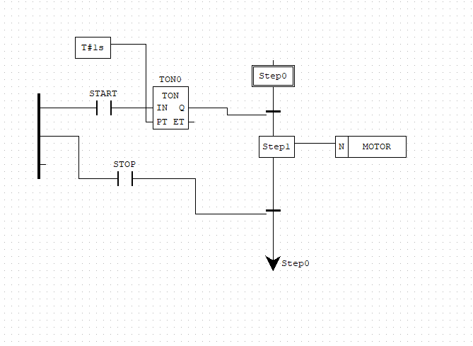
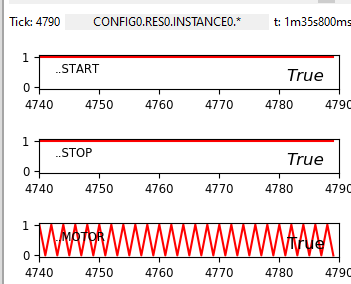
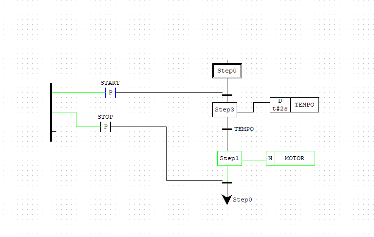
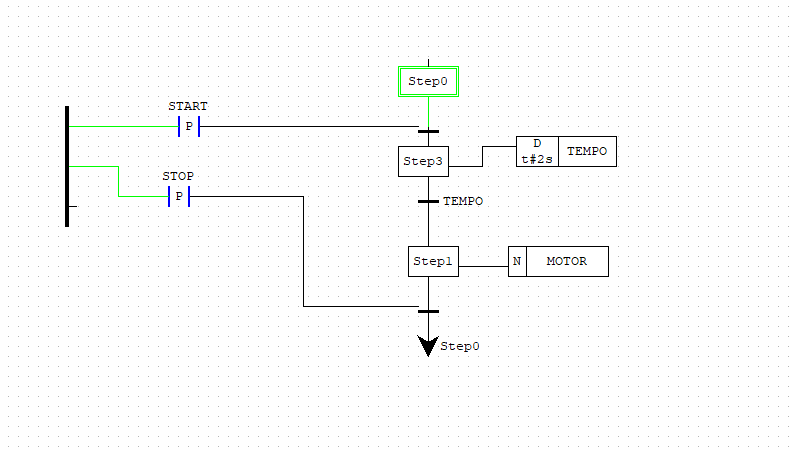
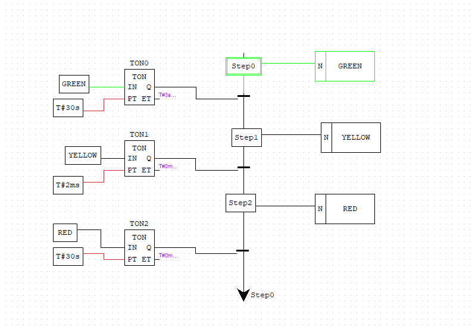
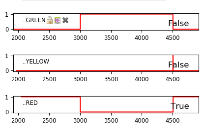

*Hugo Jacotot : 71802786*

*Gabriel Teixeira : 21950970*

*Matthieu Le Franc : 71800858*

# Programmation des automates et développement logiciel

## Difficultés rencontrées

Le logiciel n'étant pas disponible pour une distribution Linux de type Arch et le docker fourni n'étant plus disponible, 2 des 3 membres du groupe ont dû réaliser le TP ensemble sur une même machine.

## Remarques

**Qu'avez vous pensé du développement en langage Ladder (LD) ?**

Le langage Ladder est très proche de la logique booléenne, il a donc été assez facile de comprendre comment implémenter un programme simple. Cependant, pour écrire un programme plus complexe, il semble difficile d'utiliser le langage Ladder qui est peut être moins adapté. 

**Par exemple :** pour l'utilisation de boucles et branchements conditionnels ou la réutilisation du code car l'implémentation de fonctions ne semble pas si trivial à première vue.

## Exercice 1

## Exercice 2

Dans le cadre de l'exercice 2, on nous demande de programmer en SFC le cahier des charges d'un ventilateur. Nous devons respecter les contraintes suivantes :
- Le ventilateur démarre une seconde après avoir appuyé sur "start".
- Le ventilateur s'arrête uniquement lorsque "stop" est enclenché.

Nous disposons de deux boutons, **start** et **stop**, que nous avons modélisés avec des booléens initialisés à **false** au démarrage et passant à **true** lorsqu'on appuie dessus. De manière similaire, le ventilateur est représenté par une variable booléenne **Motor** qui indique s'il est en marche ou pas.

Nous avons implémenté les deux exemples de l'énoncé que nous avons copiés pour les tester.

**Premier exemple :**

Dans cet exemple, on peut observer un problème évident. Lorsqu'on exécute le code et que l'on met **start** à **true**, le ventilateur démarre. Cependant, si ensuite on met **stop** à **true**, un comportement gênant se produit :

Comme on peut le constater, le moteur démarre et s'éteint en boucle jusqu'à ce que l'une des valeurs soit mise à "false". Les contraintes sont respectées, mais la solution ne semble pas satisfaisante.

**Deuxième exemple**, on appuie une fois sur start :

On stop : 

Dans cet exemple, on ne prend en compte la modification des variables que lors d'un front montant. Ainsi, lors de nos tests, on allume le ventilateur, puis on l'éteint. Même si la valeur de **start** est à **true**, le ventilateur reste éteint, car on n'a pas appuyé de nouveau sur le bouton "start". De la même manière, même si **stop** est à **true**, le ventilateur ne s'arrête pas, car il faut réappuyer sur le bouton **stop**.

Le seul inconvénient de cette modélisation est que la pause est de 2 secondes après avoir appuyé sur **start**, une seconde de plus que ce qui était précisé dans notre contrainte.

**En conclusion**, la première implémentation qui respecte le cahier des charges ne paraît pas correcte dans le cadre de l'utilisation d'un ventilateur, tandis que la seconde semble plus cohérent et correcte si on diminue d'une seconde le temps de pause entre l'état ``start=true`` et ``motor->true``

## Exercice 3

**En conclusion**, la réalisation du sémaphore en suivant les exigences du **CRML** et en ajoutant les contraintes manquantes a été réalisé. Nous avons opté pour une implémentation en **SFC** plutot que du **Ladder** qui semblait peu approprié.
La solution que nous avons mis en œuvre repose sur des états T, où la variable correspondante est activée à l'aide du qualificatif N, et des transitions qui, en fonction d'une entrée, décide du passage à l'état suivant. Pour assurer que le temps d'attente défini (X) à l'état T était respecté, nous avons utilisé un temporisateur (TON0), déclenché dès que la valeur de l'état T devient vraie. Une fois le délai écoulé, la transition s'effectue, et la valeur repasse à faux.

La vérification du bon fonctionnement du sémaphore a été réalisée en testant plusieurs fois son évolution. Nous nous sommes assurés que le comportement correspondait aux attentes et respectait les spécifications du cahier des charges.

Cependant, des problèmes ont été rencontrés initialement, notamment dans l'utilisation des qualificatifs couplés **SL** associés à des blocs **NOT IN**. Cette approche n'a pas produit le comportement souhaité, conduisant à une réévaluation de la solution. Nous avons du oublier le modèle ou l'on vérifiait que si ``GREEN == true`` alors ``YELLOW == false`` pour une une approche différente, ce qui nous a permis de résoudre ces problèmes et parvenir à un fonctionnement cohérent du sémaphore.

En somme, la programmation du sémaphore sur **OpenPLC** a été une expérience enrichissante, illustrant l'importance d'itérer et d'ajuster la conception en fonction des résultats observés. Cette démarche a permis d'aboutir à une solution robuste et conforme aux exigences établies tout en étant simple.