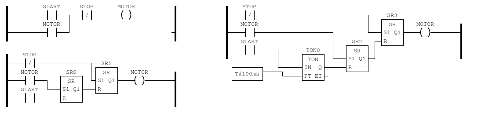
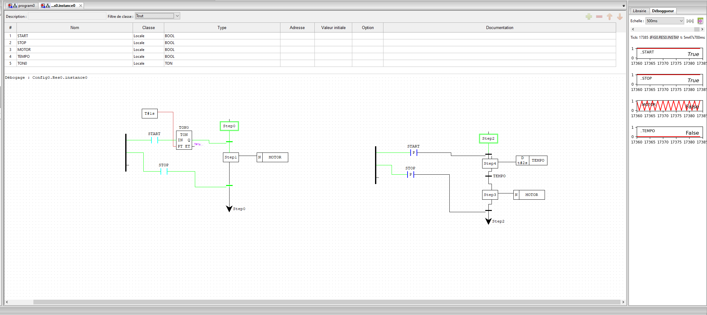
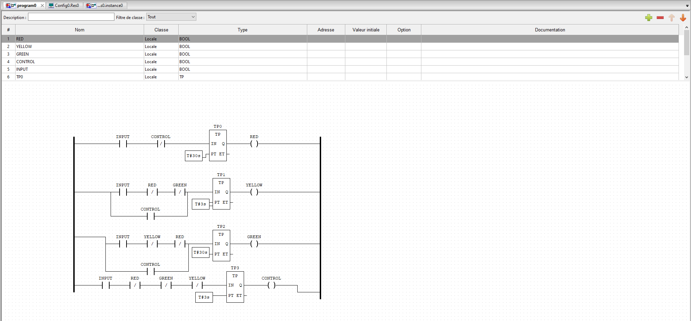

*Hugo Jacotot : 71802786*

*Gabriel Teixeira : 21950970*

*Matthieu Le Franc : 71800858*

# Programmation des automates et développement logiciel

## Difficultés rencontrées

Le logiciel n'étant pas disponible pour une distribution Linux de type Arch et le docker fourni n'étant plus disponible, 2 des 3 membres du groupe ont dû réaliser le TP ensemble sur une même machine.

## Remarques

**Qu'avez vous pensé du développement en langage Ladder (LD) ?**

Le langage Ladder est très proche de la logique booléenne, il a donc été assez facile de comprendre comment implémenter un programme simple. Cependant, pour écrire un programme plus complexe, il semble difficile d'utiliser le langage Ladder qui semble inadapté. 

**Par exemple :** pour l'utilisation de boucles et branchements conditionnels ou la réutilisation du code car l'implémentation de fonctions ne semble pas si trivial.

## Exercice 1

## Exercice 2

Dans cet exercice, on observe dans notre première modélisation qu'en fixant les valeurs de **start** et **stop** à **vrai**, le moteur fonctionne et s'arrête en continue. Cela conduit à une non-conformité avec les exigences, car le moteur ne s'arrête jamais réellement. En revanche, dans la deuxième modélisation, le moteur démarre uniquement à chaque front montant. Il est alors nécessaire de remettre la valeur de **start** à **faux** avant de redémarrer la voiture. Celle-ci ne démarre qu'après un délai de 2 secondes, conforme aux spécifications, et s'arrête précisément lorsqu'on réitère le cycle (passage de "start=false" à "start=true").

## Exercice 3

Ici on décrit sur OpenPLC les exigences du model de feu rouge. On a 4 input : un pour le **control**, un pour le feu **rouge**, un pour le feu **vert** et un pour le feu **jaune**. Le circuit de control permet de séquentiellement passer entre chaque état sans qu'ils ne puissent être activés en même temps. D'après les spécifications, les feux vert et rouge doivent être activés pendant 30 secondes et la transition vers le feu jaune s'effectuer en moins de 0.2s. La durée d'activation du jeu jaune est 1/10e de la durée d'activation des autres feux. Le feu jaune est donc activé pendant 3 secondes.

