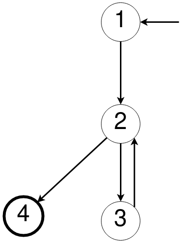
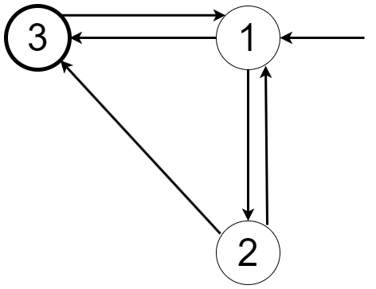

*Hugo Jacotot : 71802786*
*Gabriel Teixeira : 21950970*
*Matthieu Le Franc : 71800858*

## Exercice 1

```java
public static int lastZero(int [] x) {
    for (int i = 0; i < x.length; i++) {
            if (x[i] == 0) return i;
    }
    return -1;
}
```

**1/. Expliquez ce qui ne va pas avec le code donné. Décrivez le défaut précisément en proposant une modification du code.**

Le défaut est dans la méthode ``lastZero`` qui commence à chercher des   zéros à l’index 0 au lieu de l’index de fin du tableau x, comme cela est nécessaire pour les tableaux en Java, s l'on veut la dernière occurence.Par exemple, lastZero ({1, 7, 0}) est correctement évalué à la postion 2, tandis que numZero ({0, 7, 0}) est évalué incorrectement à la position 0.

Voici une correction possible :

```java
public static int lastZero_correction(int [] x) {
    for (int i = x.length-1; i >= 0; i--) {
            if (x[i] == 0) return i;
    }
    return -1;
}

```

**2/. Si possible, donnez un scénario de test qui n'exécute pas le défaut. Sinon, expliquez brièvement pourquoi.**

x = {}
On ne rentre jamais dans le for dans ce cas là et donc le défaut n'est jamais executé
```java
@Test
public void testQuestion2() {
        int[] x1 = {};
        assertEquals(-1, lastZero(x1));
}
```

**3/. Si possible, donnez un scénario de test qui exécute le défaut, sans l'apparition d'une erreur. Sinon, expliquez brièvement pourquoi.**

Il n'existe pas de cas test passant par le défaut et n'executant pas l'erreur. Cet état est erroné précisément parce que la valeur de i devrait être la longueur du tableau à la première itération, et on devrait aller de la fin vers le début si on veut retourner i dès qu'on trouve zéro.

**4/. Si possible, donnez un scénario de test qui entraine une erreur, mais sans une défaillance visible. Sinon, expliquez brièvement pourquoi.**

x = {...,0,..} un tableau avec un seul 0 executera le défaut et donc l'erreur, mais en regardant la valeur retournée on ne le remarque pas puisqu'il retournera bien l'indice de la dernière occurence de zéro et on ne voit donc pas la défaillance.

```java
@Test
public void testQuestion4() {
        int[] x1 = {1, 1, 0};
        assertEquals(2, lastZero(x1));
}
```

**Pour le scénario de test donné, décrivez le premier état d'erreur. Assurez-vous de décrire l'état complet (avec le program counter)**

-> x = {0, 1, 0} (scénario pour décrire le premier état d’erreur)

Dans ce scénario, le tableau contient un zéro à l'indice 0, et le défaut (qui commence à chercher des zéros à l'indice 0 au lieu de l'indice de fin du tableau) sera exécuté. La fonction lastZero va renvoyer 0 au lieu de 2. Le premier état d'erreur se produit lors de la première itération de la boucle, où l'état complet est :

- x = {0, 1, 0}
- i = 0
- PC = "i < x.length"

Cet état est erroné car la fonction cherche des zéros à l'indice 0, alors que pour trouver le dernier zéro, elle devrait commencer à l'indice de fin du tableau.

## Exercice 2

## Exercice 3

**1.**



**Graph :** 

- Entrée : 1
- Transitions : 1->2, 2->3, 2->4, 3->2
- Sortie : 4

**2/. Si possible, écrivez les chemins de test qui atteignent la couverture des noeuds mais pas la couverture des arcs. Sinon, expliquez pourquoi.**

- Il n'existe pas de chemin atteignant la couverture des noeuds sans la couverture des arcs. En effet, en partant du noeud de départ (1), on passe forcément par le noeud (2), puis, pour avoir une couverture de tous les noeuds, on doit passer par le noeud (3) qui nous donne un arc retour vers (2) pour enfin arriver au noeud de sortie (4). Ainsi on couvre tous les noeuds mais aussi tous les arcs.

**3/. Si possible, écrivez les chemins de test qui atteignent la couverture des noeuds mais pas la couverture de paires des arcs. Sinon, expliquez pourquoi.**

- 1->2->3->2->4 : On couvre tous les noeuds mais pas toutes les paires d'arcs (paires d'arc non couverte : [1; 2; 4], [3; 2; 3] )

**4/. Ecrivez les chemins de test qui atteignent la couverture des paires des arcs :**
- 1->2->3->2->3->2->4
- 1->2->4

## Exercice 4



**1/. Parmis les chemins répertoriés, lesquels sont des chemins de test ? Pour tout chemin qui n'est pas un chemin de test, expliquez pourquoi.**
- Le chemin **p1 = [1;2;3;1]** n'est pas un chemin de test car il ne termine pas dans l'état final 3 
- Le chemin **p2 = [1;3;1;2;3]** est bien un chemin de test car il commence dans l'état initial 1 et termine dans l'état final 3 
- Idem pour **p3 = [1;2;3;1;2;1;3]**
- Le chemin **p4 = [2;3;1;3]** n'est pas un chemin de test car il ne commmence pas dans l'état inital p1
- Le chemin **p5 = [1;2;3;2;3]** n'est pas un chemin de test car il propose d'emprunter l'arc 3 -> 2 qui n'existe pas sur le graphe

**2/. Enumérez les huit exigences de test pour la couverture des paires des arcs (les sous chemins de longueur deux).**
- 1 -> 2 -> 1
- 1 -> 2 -> 3
- 1 -> 3 -> 1
- 2 -> 1 -> 3
- 2 -> 1 -> 2
- 2 -> 3 -> 1
- 3 -> 1 -> 3
- 3 -> 1 -> 2

**3/. L'ensemble des chemins de test de la question 1 ci-dessous satisfait-il la couverture des paires des arcs ? Sinon, indiquez pourquoi.**

La couverture des paires des arcs n'est pas satisfaite par l'ensemble des chemins de test car celui-ci ne couvre pas les paires 2 -> 1 -> 2 et 3 -> 1 -> 3.

**4/. Considérons le chemin prime [3; 1; 3] et le chemin p3. Est-ce que p3 fait un voyage directement dans ce chemin prime ? Est-ce qu'il fait un voyage avec un détour ?**

- p3 ne fait pas de voyage directement dans [3; 1; 3].
- En revanche, p3 effectue un voyage avec un détour par les arcs [1; 2; 1].

## Exercice 5

Voici le programme qui calcule tous les chemin primes dans un graphe :

```python
def trouver_chemins(graph, start, end, path=[]):
    path = path + [start]
    if start == end:
        return [path]
    if start not in graph:
        return []
    paths = []
    for node in graph[start]:
        if node not in path:
            newpaths = trouver_chemins(graph, node, end, path)
            for newpath in newpaths:
                paths.append(newpath)
    return paths

# les clefs sont les noeuds et les valeurs associées sont les noeuds voisins
graph_ex4 = {
    '1': ['2', '3'],
    '2': ['1', '3'],
    '3': ['1'],
}

graph_ex3 = {
    '1': ['2'],
    '2': ['4', '3'],
    '3': ['2'],
    '4': [],
}

start_node = '1'
end_node = '3'
print("Chemins premiers (graph exercice 4) de {} à {} :".format(start_node, end_node))
for path in trouver_chemins(graph_ex4, start_node, end_node):
    print(path)

start_node = '1'
end_node = '4'
print("Chemins premiers (graph exercice 3) de {} à {} :".format(start_node, end_node))
for path in trouver_chemins(graph_ex3, start_node, end_node):
    print(path)
```

Voici le retour après exécution :

```
Chemins premiers (graph exercice 4) de 1 à 3 :
['1', '2', '3']
['1', '3']
Chemins premiers (graph exercice 3) de 1 à 4 :
['1', '2', '4']
```