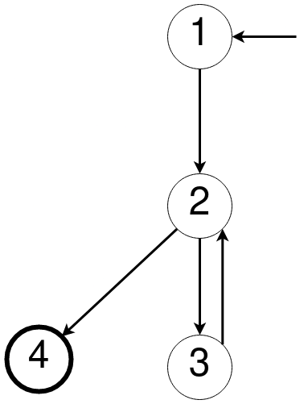

## Exercice 3

**1.**

**Graph :** 

- Entrée : 1
- Transitions : 1->2, 2->3, 2->4, 3->2
- Sortie : 4

**2/. Si possible, écrivez les chemins de test qui atteignent la couverture des noeuds mais pas la couverture des arcs. Sinon, expliquez pourquoi.**

- Il n'existe pas de chemin atteignant la couverture des noeuds sans la couverture des arcs. En effet, en partant du noeud de départ (1), on passe forcément par le noeud (2), puis, pour avoir une couverture de tous les noeuds, on doit passer par le noeud (3) qui nous donne un arc retour vers (2) pour enfin arriver au noeud de sortie (4). Ainsi on couvre tous les noeuds mais aussi tous les arcs.

**3/. Si possible, écrivez les chemins de test qui atteignent la couverture des noeuds mais pas la couverture de paires des arcs. Sinon, expliquez pourquoi.**

- 1->2->3->2->4 : On couvre tous les noeuds mais pas toutes les paires d'arcs (paire d'arc non couverte : 1->2->4)

**4/. Ecrivez les chemins de test qui atteignent la couverture des paires des arcs :**
- 1->2->3->2->4
- 1->2->4
