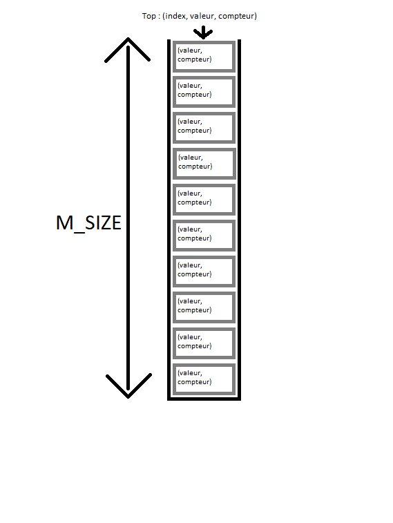

*Matthieu Le Franc : 71800858*

*Hugo Jacotot : 71802786*

# TP6

## Exercice 1

**Montrer que le numéro de consensus d’un objet pile est 2**

Le numéro de consensus représente le nombre minimum de processus requis pour parvenir à un accord sur une valeur commune. Pour un objet pile, le numéro de consensus est 2 car il faut au minimum deux processus pour réaliser une opération de push ou pop. En effet, pour réaliser une opération de push, il faut au minimum un processus pour réaliser l'opération et un autre pour valider l'opération. Il en va de même pour l'opération de pop.

## Exercice 2

**On propose d’implémenter une pile d’objets de capacité M_SIZE avec un tableau partagé Stack de M_SIZE éléments, chaque élément est un couple : valeur, compteur. Le haut de la pile (la variable partagée Top) est un triple index, valeur, compteur. On utilise des compare_ and_ swap (V.C&S(b,c) signifie si la valeur qui est dans V est égale à b alors on affecte c à V et on retourne vrai sinon on retourne faux) Initialement T op est (0, Null, 0) et tous les éléments de Stack sont initialisés à (Null,0) le pseudo code suivant**



```
push(v) {
    while (true) {
        (index, value, counter) <-- Top
        stackTop <-- Stack[index].value
        Stack[index], C&S( (stackTop, counter-1), (value,counter) )
        if (index=M_SIZE-1 ) then return Full
        aboveTop<-- Stack[index+1].counter
        if (Top.C&S( (index, value, counter), (index+1, v, aboveTop+1))) then return ok
    }
}
pop(){
    while (true){
        (index, value, counter) <-- Top
        stackTop<--Stack[index].value
        Stack[index].C&S( stackTop,counter-1), (value, counter)
        if (index=0) then return Empty
        belowTop<-- Stack[index-1]
        if (Top.C&S( (index, value, counter), (index-1, belowTop.value,belowTop.counter+1))) then return valu
    }
}
```

**1/. A-ton besoin d’utiliser des compare_and_ swap pour implementer une pile ?**

Oui, on a besoin d'utiliser des compare_and_swap pour implémenter la pile. En effet, le compare_and_swap permet de réaliser des opérations atomiques, c'est-à-dire que l'opération est effectuée sans être interrompue par un autre processus. Cela permet d'éviter les problèmes de concurrence car compare and swap garantie que les opérations de push et pop sont effectuées de manière sûre (pas interrompue par d'autres threads).

**2/. L’implémentation réalise-t-elle une pile atomique? (Où sont les points de linéarisation ?)**

L'implémentation réalise une pile atomique. Les points de linéarisation sont les opérations de compare_and_swap. En effet, ces opérations sont atomiques et garantissent que les opérations de push et pop sont effectuées de manière sûre.

Points de linéarisation :
- L'opération push avec : Stack[index], C&S( (stackTop, counter-1), (value,counter) )
- L'opération pop avec : Stack[index].C&S( stackTop,counter-1), (value, counter)

**3/. L’implémentation proposée est-elle non blocking ? wait-free ?**

L'implémentation proposée n'est pas non blocking car, compare and swap étant atomique, si un processus est en train de réaliser une opération de push ou pop, les autres processus doivent attendre que l'opération soit terminée pour réaliser la leur.
L'implémentation n'est pas non plus wait-free car elle n'assure pas que chaque processus termine son opération en un nombre fini d'étapes. En effet, si un processus est interrompu par un autre processus, il doit attendre que l'opération de l'autre processus soit terminée pour réaliser la sienne.

**4. Implémenter cette pile en java à l’aide du package concurrent.**

## Exercice 3

**On a un objet snapf aible muni de 2 opérations write et scan. Sa spécification séquentielle est la même que celle du snapshot. Une thread qui l’utilise fait un write suivi d’un scan une seule fois. Pour l’implémenter pour n threads, on utilise un tableau partagé tab de n éléments. Le pseudo code d’une thread Ti est le suivant**

```
void write (v){
    variables locales :
        b=un booléen initialisé à vrai ;
        L=un ensemble initialisé à {(v, i)};
    
    while (b) {
        for (i=0; i<n; i++) {
            tab[i]=L;
            lire le tableau tab:
            ajoute les valeurs jamais vues à L 
            si tous les éléments de tab sont égaaux à L alors b=faux
        }
    }
}

T[] scan() {
    variables locales :
        b=un booléen initialisé à vrai ;
        L=un ensemble initialisé à vide;
        L alors b=faux
        
    for (i=0; i<n; i++) {
        L=L union {tab[i]\;}
    }
    while (b) {
        for (i=0; i<n; i++) {
            tab[i]=L;
            lire le tableau tab:
            ajoute les valeurs jamais vues à L
            si tous les éléments de tab sont égaux à L alors b=faux
        }
    }
    mettre dans un tableau à l’indice $i$ la valeur de $v$ si $(v, i)$ est present dans L;
    retourner ce tableau ;
}
```

**1. Si n threads exécutent write, puis scan, est il possible qu’une thread ne termine pas ?**

Oui, une attente infinie peut se produire lorsque deux threads effectuent la lecture et la mise à jour de tab en même temps.

- 1. Deux threads T1 et T2 exécutent write en même temps
- 2. Les deux threads mettent à jour le tableau avec leur ensemble L1 et L2
- 3. Avant que T1 ne puisse lire le tableau, T2 met à jour le tableau remplaçant la première mise à jour
- 1-2-3 se répètent indéfiniment avec T1 et T2 se chevauchant à la mise à jour sans jamais laisser l'autre terminer.

**2. On exécute 2 threads T1 et T2, T1 exécute write(v1) et T2 write(v2). Est il possible que T2 ne mette jamais v1 dans son ensemble L? Dans ce cas quelle valeur T1 a-t-elle dans son ensemble L?**

Oui c'est possible à cause de la concurrence sur la mise à jour de tab. Si T2 n'a jamais mis v1 dans son ensemble L, alors lorsque T1 exécute scan(), T1 ne récupérera pas forcément v1 dans son ensemble L selon l'ordre d'exécution des threads.

**3. On exécute 3 threads T1, T2 et T3 ou T1 exécute write(v1), T2 write(v2) et T3 write(v3). Est il possible que ni T1 ni T2 ne mettent jamais la valeur de v3 dans leur ensemble L? Dans ce cas quelles valeurs T1 et T2 peuvent elles avoir dans leur ensemble L?**

Oui c'est possible si T3 termine ton exécution write avant que T1 et T2 aient mis à jour leurs ensembles L.

- Si T3 termine d'exécuter write avant T1 et T2, alors T1 et T2 n'auront pas v3 dans leur ensemble L.
- Si T3 termine son exécution après que T1 et T2 aient mis à jour leurs ensemble L, alors T1 et T2 auront v3 dans leurs ensembles L.

**4. Si une thread qui exécute write(v) termine à l’instant t, est ce que toutes les threads qui commencent après t (qu’elles terminent ou pas) auront dans leur ensemble L la valeur v?**

Non, car les autres threads peuvent avoir commencé leur exécution avant que la première thread n'ait mis à jour le tableau partagé tab avec v. Cela dépend donc de la gestion de la synchronisation.

**5. Si on exécute n threads quelle sont les valeurs possibles des ensembles L?**

Les valeurs possibles des ensembles L sont les valeurs v des threads qui ont terminé leur exécution write(v) avant que les autres threads n'aient commencé leur exécution.

**6. L’implémentation du snapf aible proposée est-elle linéarisable ? est-elle wait free?**

L'implémentation du *snapfaible* proposée n'est pas linéarisable car il n'y a pas de garantie d'un ordre global pour les écritures dans ce tableau. La vérification des ensembles L dans les fonctions write et scan est effectuée localement par chaque thread sans considération pour l'ordre global des opérations.

L'implémentation n'est pas non plus wait-free car, compare and swap étant atomique, si un processus est en train de réaliser une opération de write ou scan, les autres processus doivent attendre que l'opération soit terminée pour réaliser la leur.

**7. Implémenter cet objet en java.**

**8. Répondre à nouveau à la question 6 , si le tableau tab contient n/2 éléments ( n > 6) et que l’objet est utilisé par n threads.**