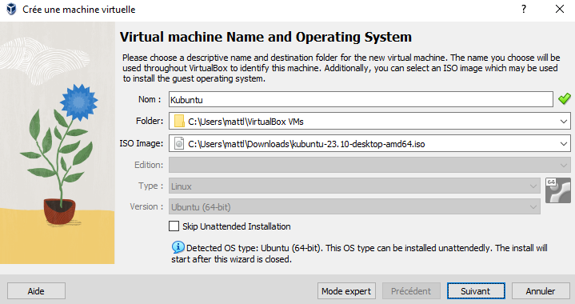
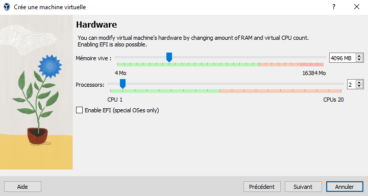
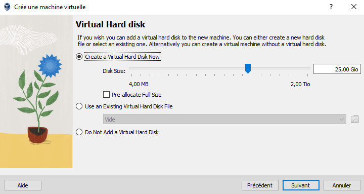
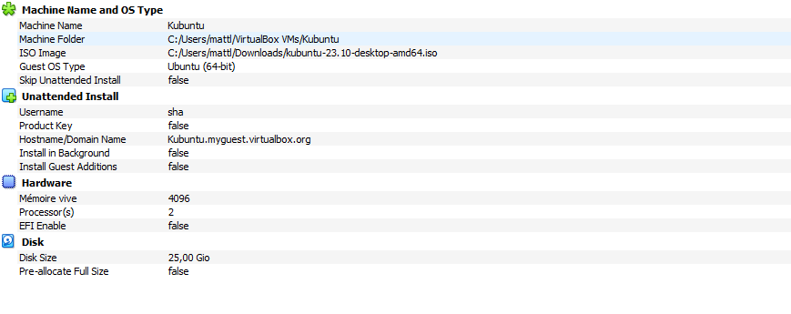
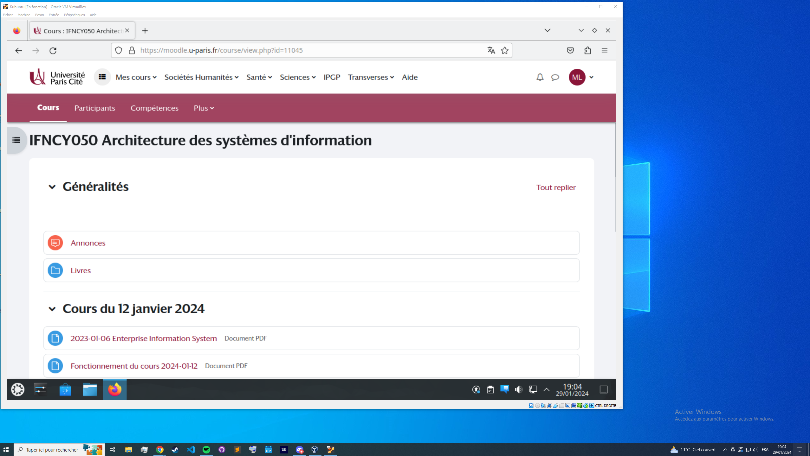

**TP n°1 V n°1**

**Titre du TP :** Virtual Machine

**Date :** 29/01/2024

**Nom :** Le Franc

**Prénom :** Matthieu

**N° étudiant :** 71800858

**email :** matthieu.le-franc@etu.u-paris.fr

## Explications

### Choix de la VM

J'ai choisi d'utiliser le logiciel de virtualisation VirtualBox pour ce TP. J'ai choisi cette solution car c'est celle que j'utilise habituellement et que je la connais bien. De plus, elle est gratuite et open-source. La mise en place d'une VM avec VirtualBox est très simple, rapide et se prête bien à l'objectif de ce TP (afficher la page moodle du cours dans la VM).

### Mise en place

On clique sur l'icone vert + pour ajouter une nouvelle VM. On donne un nom à la machine et on lui communique un fichier iso pour l'installation de l'OS (ici une version d'Ubuntu intégrant plasma desktop comme environnement de bureau).

Maintenant on choisit la quantité d'hardware qu'on veut allouer à la VM. J'ai choisi 4Go de RAM et 2 coeurs de CPU (un coeur et moins de RAM aurait été grandement suffisant pour afficher une page web mais j'ai préféré allouer plus de ressources pour profiter d'y faire tourner d'autres programmes plus tard).

Pour la quantité de stockage allouée, j'ai choisi de créer un disque dur virtuel plutôt que d'utiliser un disque existant (plus sûr et plus simple). J'ai choisi un disque de 25Go (encore une fois, c'est beaucoup trop pour afficher une page web mais je préfère avoir de la marge pour la suite).

Enfin, on a ici un récapituatif de la configuration de la VM. On peut encore modifier les paramètres si besoin. On clique ensuite sur créer pour lancer la VM.

Une fois la VM installée et lancée, voici la page web du cours dans la machine virtuelle tournant sur mon ordinateur hôte.
