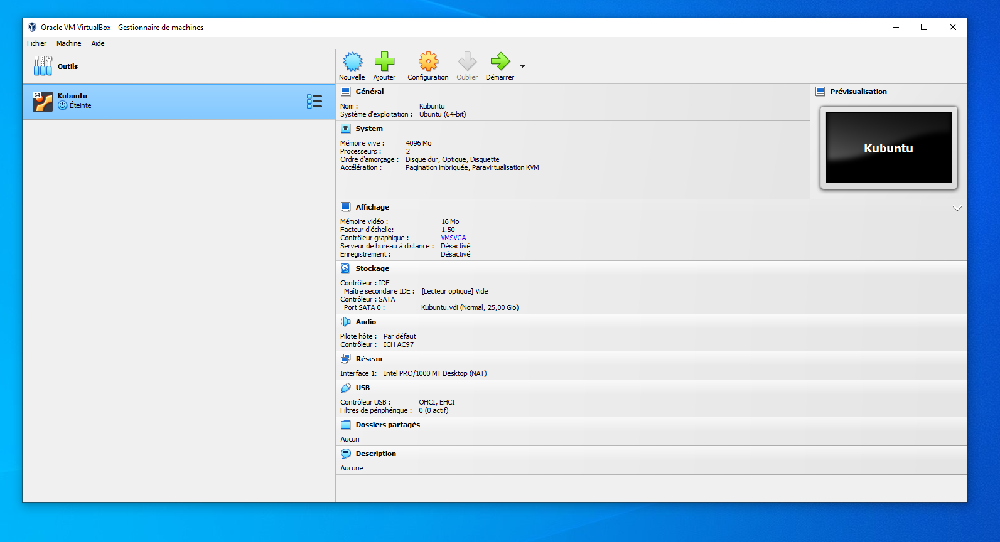
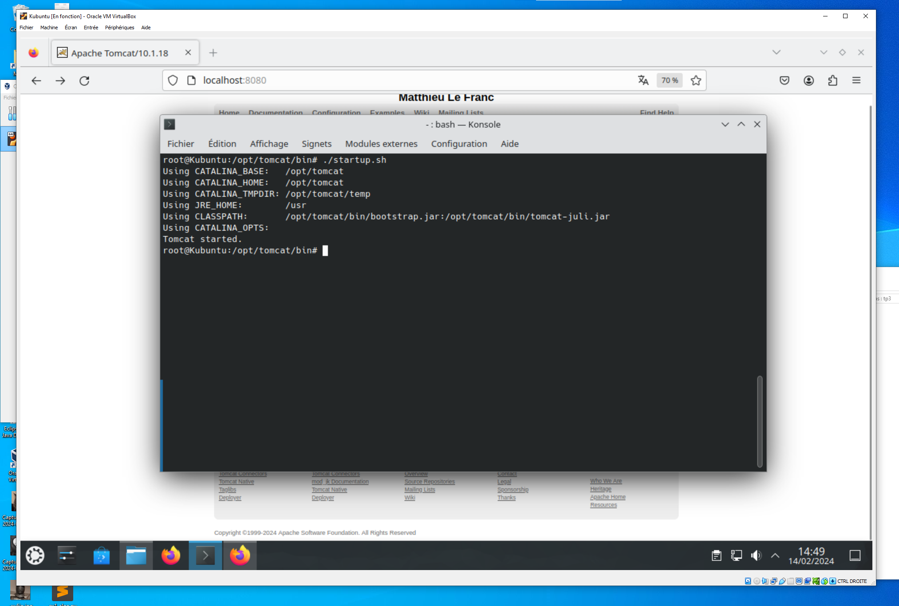
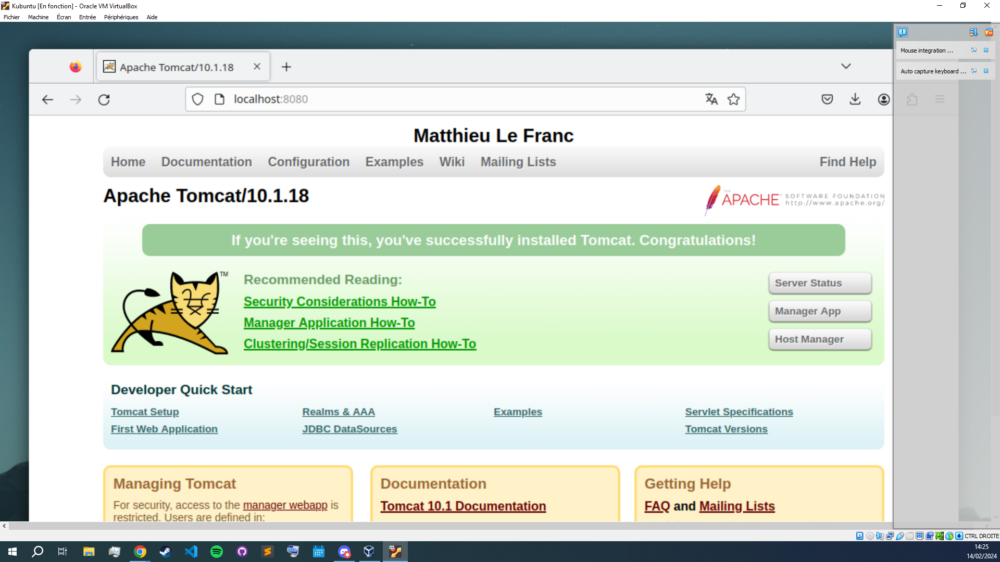
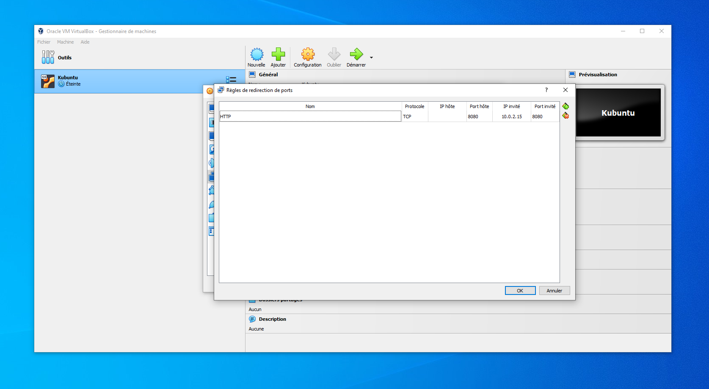
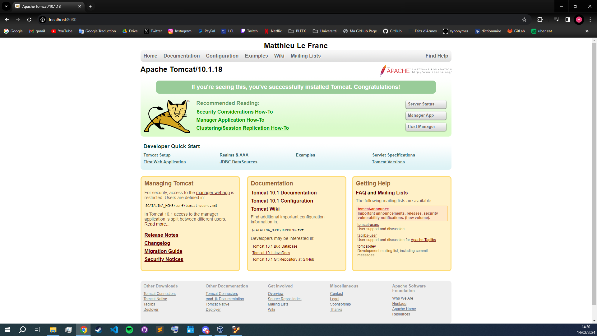
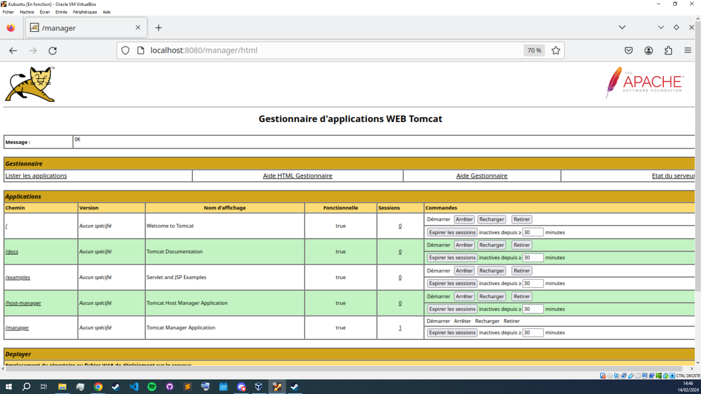
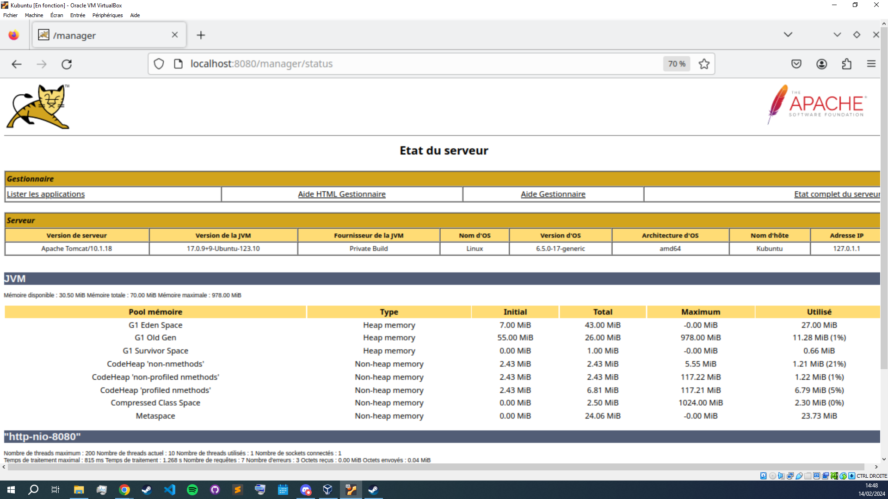

**TP n°3 V n°1**

**Titre du TP :** Virtual Machine Apache Tomcat

**Date :** 14/02/2024

**Nom :** Le Franc

**Prénom :** Matthieu

**N° étudiant :** 71800858

**email :** matthieu.le-franc@etu.u-paris.fr

## Explications

J'ai réutilisé la configuration de la VM des précédents TPs.



Après avoir lancé la VM, on s'occupe d'installer Tomcat. Pour cela, j'ai téléchargé l'archive depuis le site officiel et je l'ai extrait dans le répertoire `/opt`. 

J'ai également modifié le code source de la page pour ajouter un titre contenant mon nom et mon prénom.

J'ai ensuite créé un utilisateur **manager-gui** dans le fichier `tomcat-users.xml` du répertoire `/opt/tomcat/conf` avec cette configuration :

```xml
<user username="admin" password="1234" roles="manager-gui"/>
```

Ensuite, j'ai lancé le serveur Tomcat avec le script bash `startup.sh` dans le répertoire `/opt/tomcat/bin`.



Voici la page d'accueil de Tomcat contenant mon nom et prénom :



Pour afficher la page depuis la machine hôte, j'ai redirigé le port `8080` de la machine hôte vers le port `8080` de la VM.



Voici maintenant la page d'accueil de Tomcat depuis la machine hôte :



Pour accéder à l'interface d'administration, j'ai utilisé l'adresse `http://localhost:8080/manager/html` et j'ai renseigné les identifiants de l'utilisateur **manager-gui**.



Voici également la page de status de Tomcat :

