**TP n°4 V n°1**

**Titre du TP :** Virtual Machine Apache Tomcat Servelet

**Date :** 22/02/2024

**Nom :** Le Franc

**Prénom :** Matthieu

**N° étudiant :** 71800858

**email :** matthieu.le-franc@etu.u-paris.fr

## Explications

J'ai réutilisé la configuration de la VM des précédents TPs.

Pour réaliser ce TP, j'ai utilisé l'IDE eclipse web car il permet de créer un projet de type servelet, simplifiant la réalisation des différentes étapes ainsi que le déploiement. J'ai donc commencé par créer un projet de type "Dynamic Web Project" avec comme environement de runtime "Apache Tomcat v9.0" (version que j'ai précédemment installée sur ma VM).

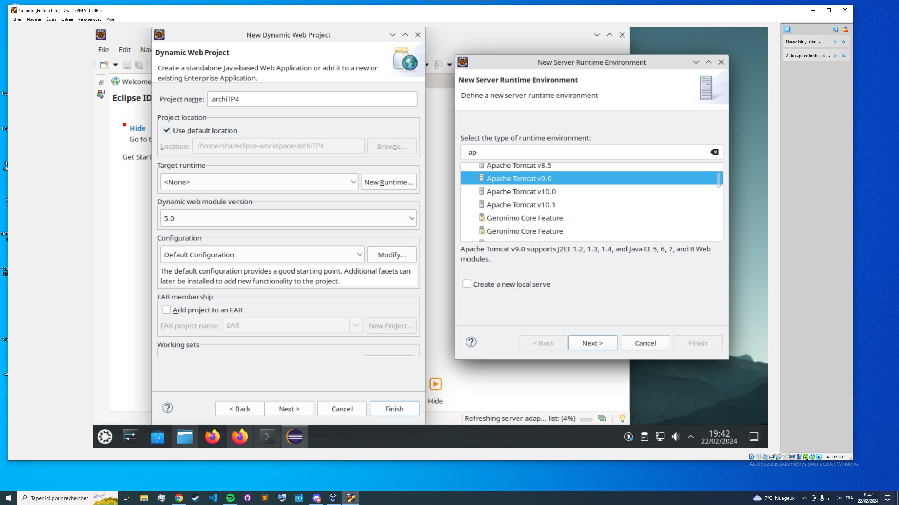

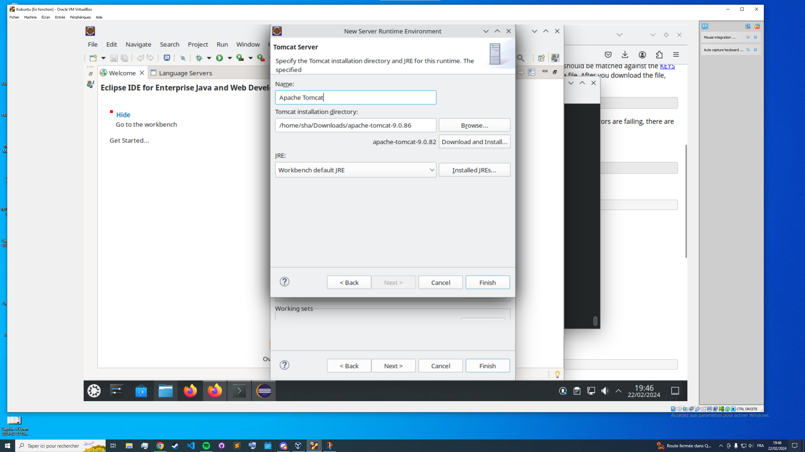

Maintenant le projet initialisé, on peut créer via eclipse un servelet (new -> servelet)

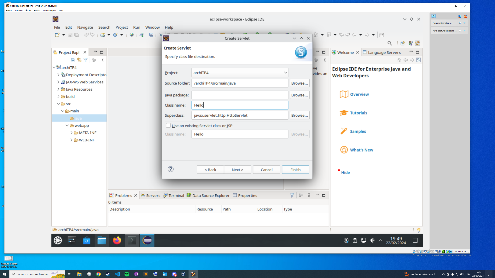

Du code de base est généré automatiquement à la création, je l'ai simplement modifié pour afficher "Hello World" suivi de mon nom et prénom dans la page web.

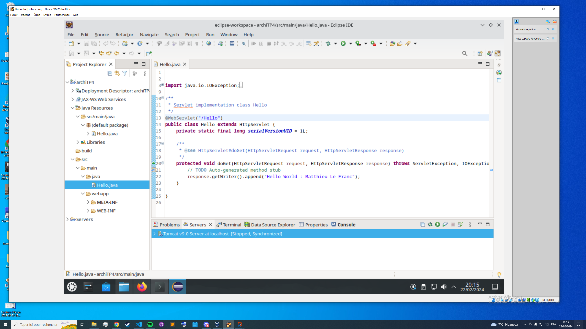

En lançant le servelet via eclipse (run as -> run on server) on peut voir un premier résultat dans le navigateur web.

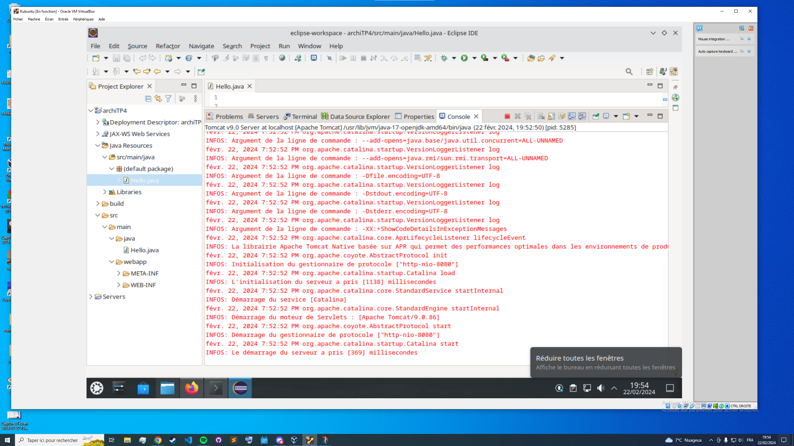
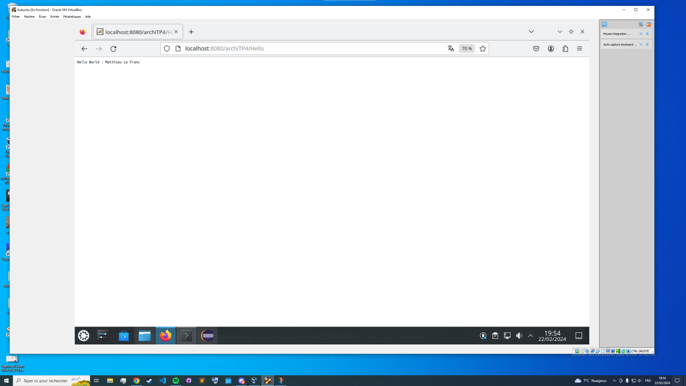

Maintenant pour mettre en ligne le servelet (en production), j'ai créé un fichier .war (web archive) en exportant le projet (export -> war file) et je l'ai déposé dans le dossier webapps de tomcat.

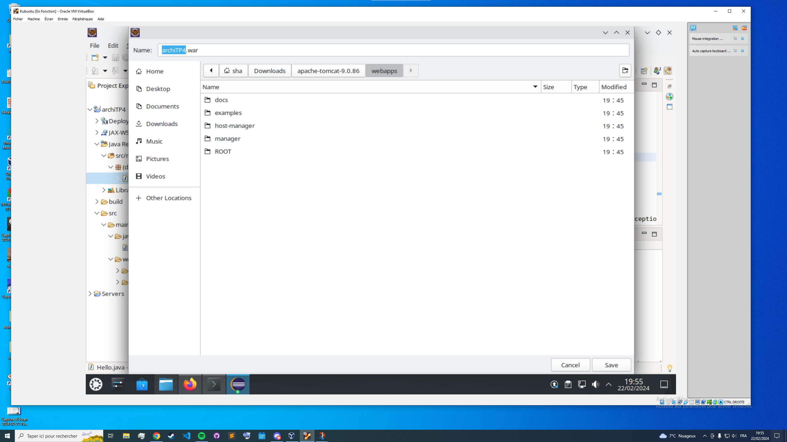

Maintenant on peut déployer tout avec ``catalina.sh run``

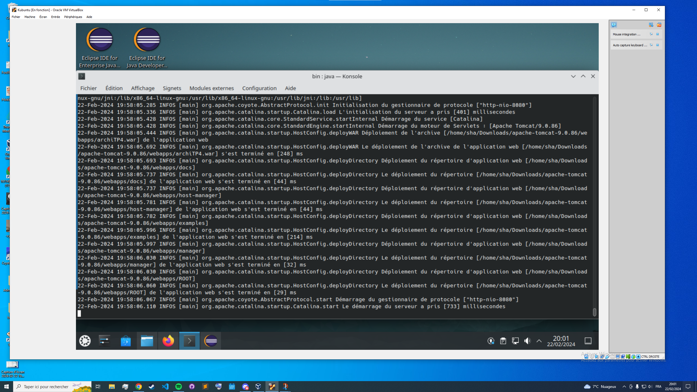

Voici l'affichage de la page web depuis la machine hote (j'avais configuré cette redirection de port dans les TPs précédents)

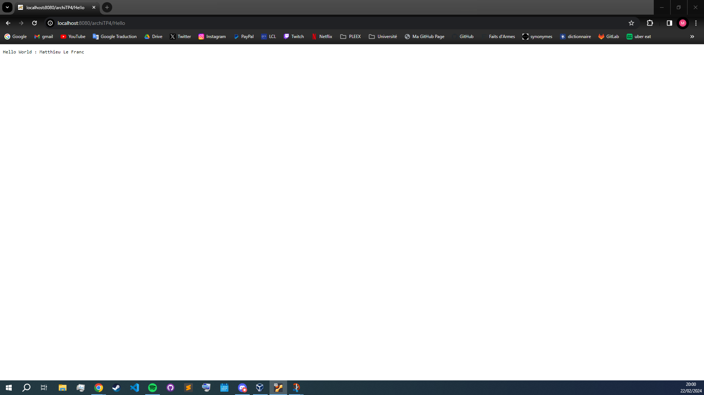

Maintenant, regardons les pages gestionnaire et état du serveur. Pour pouvoir y accèder, j'ai ajouté un utilisateur avec le role **manager-gui** dans le fichier tomcat-users.xml. On peut bien voir, sur la page **manager** par exemple, que le servelet est bien déployé (archiTP4).

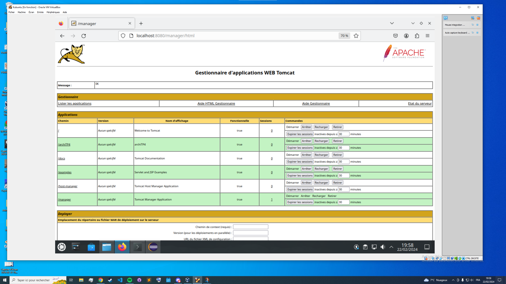
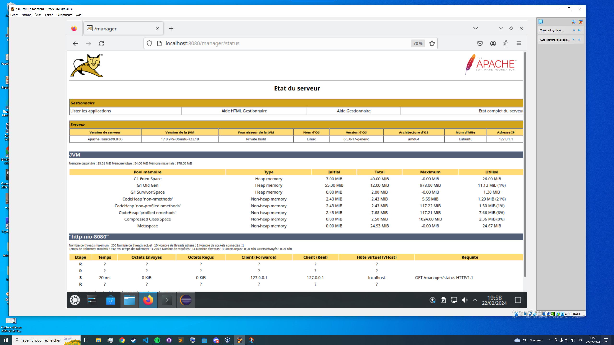