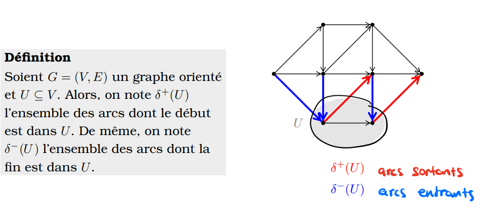
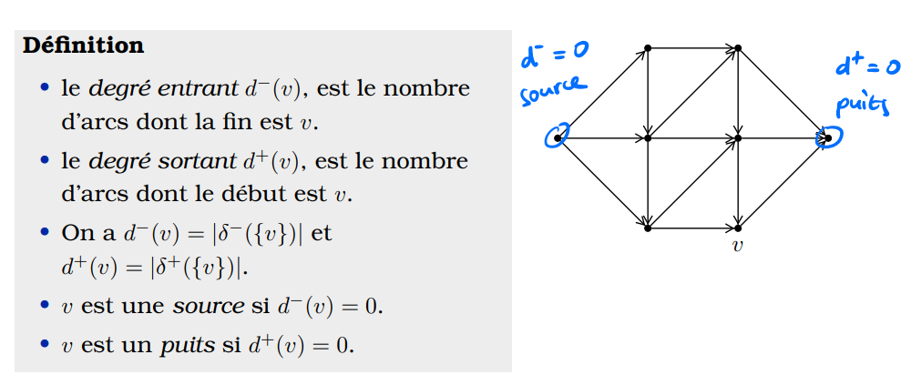
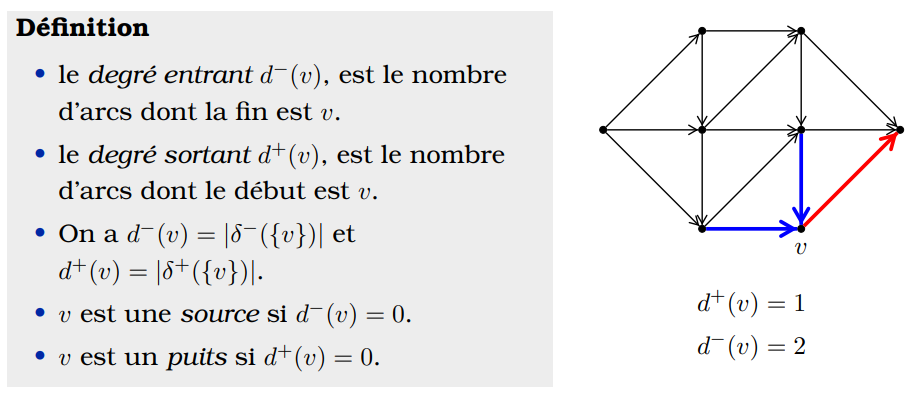
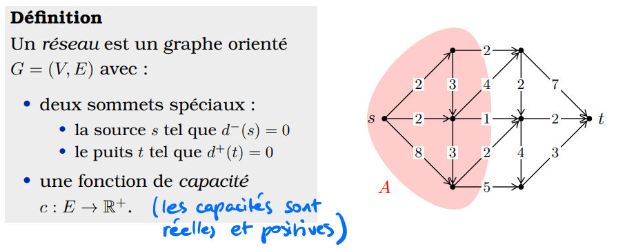
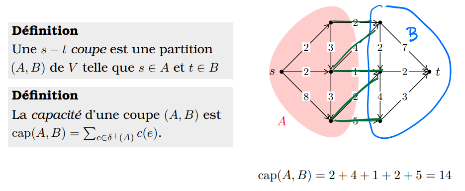
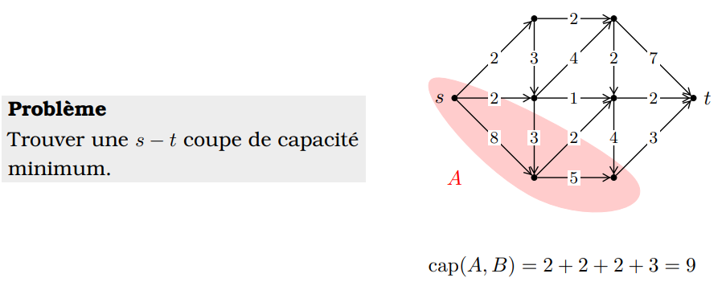
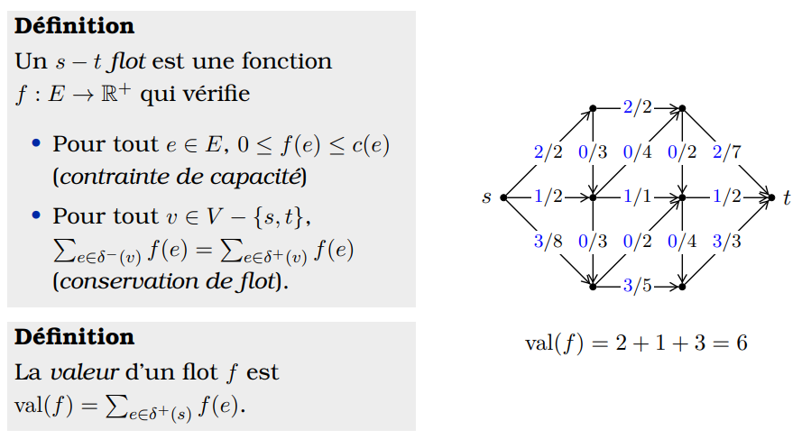
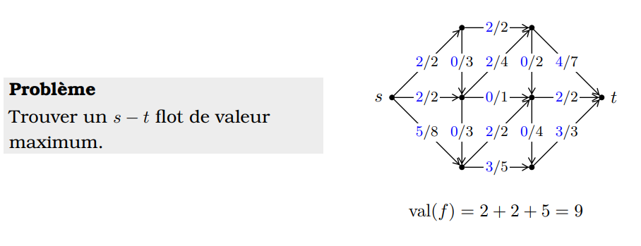
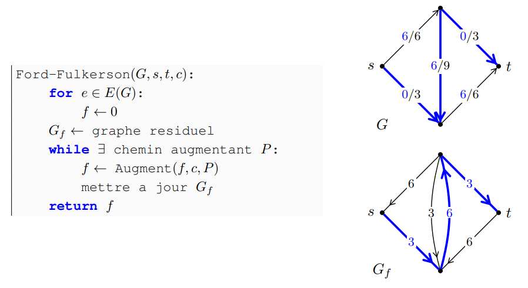
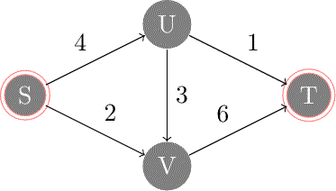

# Problèmes de flots dans les graphes

## Arcs sortants et entrants

## Degré sortant et degré entrant

## Flot max et coupe min

- Deux problèmes classiques de l’optimisation combinatoire.
- Exemple de la dualité mathématique.

### Quelques applications
- Fouille de données.
- Sélection de projets.
- Ordonnancement (par exemple compagnies aériennes).
- Segmentation de l’image.
- Connectivité et fiabilité des réseaux.
- Calcul distribuée.

### Un réseau

Une fonction de capacité est une fonction qui associe à chaque arc un nombre réel positif. C’est la capacité maximale de cet arc

### Les coupes

En d'autres termes, une s-t coupe est une partition des sommets du graphe en deux ensembles, l’un contenant le sommet s et l’autre contenant le sommet t.

#### Coupe minimum

La capacité d’une s-t coupe est la somme des capacités des arcs qui vont de l’ensemble A à l’ensemble B.

### Les flots

Un flot est une fonction qui associe à chaque arc un nombre réel positif. C’est le flot qui circule dans cet arc. La valeur d’un flot est la somme des flots qui entrent dans le sommet t moins la somme des flots qui sortent du sommet t.

#### Problème de flot maximum

Le problème de flot maximum est de trouver un flot de valeur maximale.

### Algorithme de Ford-Fulkerson

L’algorithme de Ford-Fulkerson est un algorithme qui résout le problème de flot maximum. Il utilise la méthode de la coupe minimum. L’idée est de trouver un chemin de s à t dans le graphe résiduel et d’augmenter le flot le long de ce chemin.

