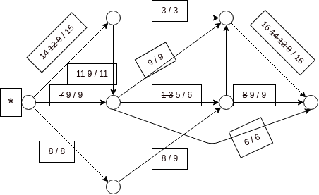

# TP4

## Exercice 1

On peut représenter le problème par un graphe orienté. Les sommets représentent les villes et un arc de u vers v représente un bus de u vers v. 
La capacité de chaque arc représente le nombre de places restant dans le bus. On cherche alors à trouver un flot max de S à T.

Q1/. Vak(F) = 31

Cap(A, B) = 31

Q2/. Il existe un S-T flot de valeur 31, donc c'est possible de placer les enfants dans les bus.

## Exercice 2

