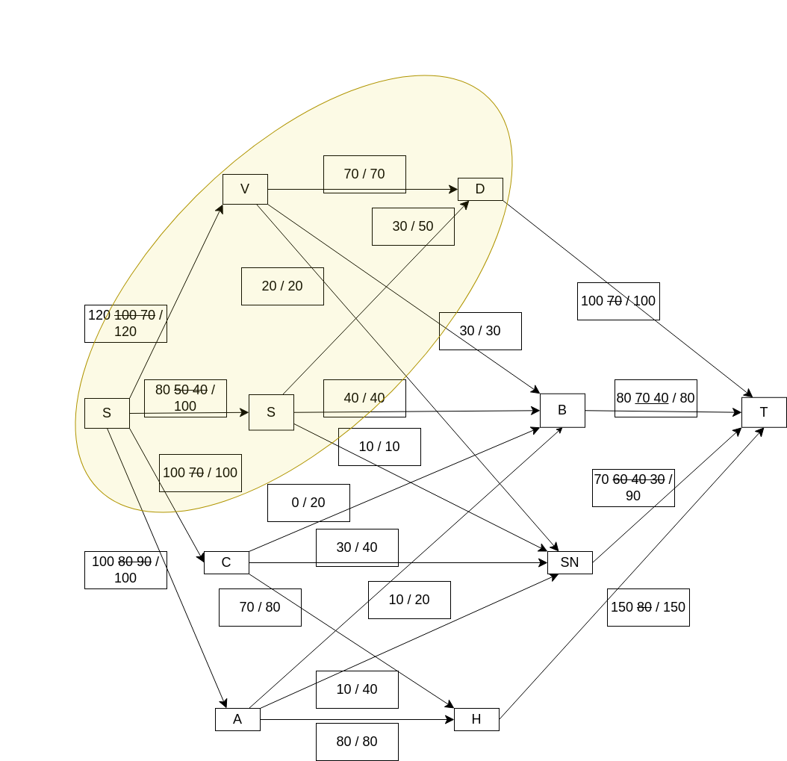
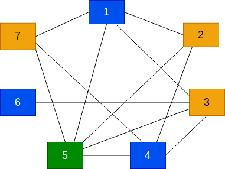

# Examen 2022

## Exercice 1

### Question 1

cap(A, B) = 100 + 30 +40 +20 + 10 + 100 + 100 = 400
val(f) = 120 + 80 + 100 + 100 = 400
Puisque cap(A, B) = val(f), on conclut que f est un flot maximum. Les demandes de Bordeaux et du Havre sont satisfaites

*Pour trouver une coupe de capacité minimum A, on prend tous les sommets atteignables depuis la source dans le graphe résiduel. C'est à dire les chemins de la source vers les stocks disponibles. Pour calculer la capacité on regarde toutes les arêtes qui sortent d'un ensemble A et on en fait la somme.*

## Exercice 2

### Question 1

On met une arête entre les sommets ssi les intervalles sont disjoints

### Question 2

Les ensembles stables correspondent à des cultures qu'on peut mettre dans un même frigo. En particulier, nombre minimum de frigos = nombre de chromatique.

### Question 3

X(6) <= 3 (voir la coloration ci-contre)

X(6) >= 3 parce que les sommets 3, 4, 5 forment une clique.

X(6) = 3 Il faut 3 frigos. Une solution possible :
- frigo 1 : 4,6°C (culture 1, 4 et 6)
- frigo 2 : 3°C (culture 2, 3 et 7)
- frigo 3 : 5,3°C (culture 5)

### Question 4

Si les capsules arrivent dans l'ordre 6, 2, 1, 4, 5, 7, 3, alors : 
- 6 et 2 sont coloriés 1
- 1 et 4 sibt coloriés 2
- 5 est colorié 3
7 et 3 sont coloriés 4

## Exercice 3

### Question 1

S : d- > d+
