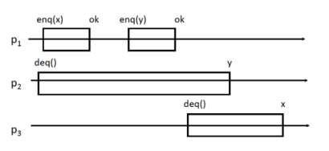

# TP3

## Exercice 1

**L’histoire ci dessous est-elle linéarisable par rapport à la specification séquentielle d’une file ?**



L'histoire est linéarisable, exemple :
1. enq(x) 
2. enq(y) 
3. deq(x) 
4. deq(y)

**p2 et p3 aurait-il pu obtenir une autre réponse à leur demande de deq ?**

Oui autre sénario possible est :
1. enq(x) 
2. deq() -> x 
3. enq(y) 
4. deq() -> y

## Exercice 2

**1/. En vous inspirant de la définition classique d’une pile donnez la définition et la spécification séquentielle de cet objet.**

Spécification séquentielle d'une pile :

Si (précondition) : 
- l'objet est dans un certain état initial (la queue est non vide)
- avant l'appel de la méthode

Then (postcondition) :
- la méthode retourne le premier élément dans la queue (ou bien une exception)

And (postcondition) :
- supprime ce premier élément de la queue, l'élément n'est plus dans la queue


**2/. On considère l’implémentation suivante :**

```java
public class PileSync {
    int t[];
    int sommet=-1;

    PileSync(int n){
        t= new int[n];
    }

    synchronized void empiler(int j) {
        sommet=sommet+1;
        t[sommet]=j;
    }
    synchronized int depiler(){
        if (sommet==-1)return -1;
            sommet=sommet-1;
            return t[sommet+1];
        }
    }
}
```

**Que l’on peut utiliser avec :**

```java	
public class AjoutThread2 extends Thread {
    public PileSync p;
    int id;
    
    public AjoutThread2 ( PileSync p, int id) {
        this.p=p;
        this.id=id;
    }

    public void run(){
        for(int i=1;i<11;i++) {
            p.empiler(i+100*id);
            try {
                Thread.sleep(10);
            }
            catch(Exception e) { 
                System.out.println( "probleme" );
            }
            this.yield();
        }

        for(int i=1;i<11;i++) {
            System.out.println("Thread "+id+" retire " +p.depiler());
            try {
                Thread.sleep(10);
            }
            catch(Exception e) { 
                System.out.println( "probleme" );
            }
            this.yield();
        }
    }
}

public class Main2 {

    public static void main( String [] v) {
        Thread[] Th = new Thread[3];
        PileSync f=new PileSync(100);

        for (int i=0;i<3;i++) {
            Th[i]= new AjoutThread2(f,i);
            Th[i].start();
        }
        
        for (int i=0;i<3;i++) { 
            try {
                Th[i].join();
            } catch(Exception e) {
                System.out.println( "probleme" );
            }
        }
    }
}
```

**Cette implémentation réalise-t-elle une implémentation linéarisable d’une pile ? Si oui indiquer les points de linéarisation.**

L'implémentation de la pile est linéarisable. En effet, les méthodes empiler et depiler sont synchronisées, ce qui garantit que les opérations sont atomiques. Ainsi, l'ordre d'exécution des opérations est respecté.

Points de linéarisation : moments où on va empiler ou dépiler avec synchronized.

```java
    synchronized void empiler(int j) {
        sommet=sommet+1;
        t[sommet]=j;
    }
    synchronized int depiler(){
        if (sommet==-1)return -1;
            sommet=sommet-1;
            return t[sommet+1];
        }
    }
```

**3/. On supprime les synchronized, l’implémentation réalise-t-elle une implémentation linéarisable d’une pile dans les cas suivants: (Si non indiquez quelles propriétés sont perdues, si oui indiquez les points de linéarisation)**

**(a) Il n’y a pas de concurrence entre les appels des threads.**

Implémentation linéarisable d'une pile, synchronized est superflu car sans concurence, les opérations sont atomiques.

**(b) Quand il y a concurrence entre deux threads, c’est 2 threads qui appellent empiler**

On ne peut pas appeler cela une implémentation linéarisable car si deux thread empilent en même temps, l'opération n'est plus atomique.

**(c) Quand il y a concurrence entre deux threads, c’est 2 threads qui appellent dépiler**

On ne peut pas appeler cela une implémentation linéarisable car, comme pour l'empilage, si deux thread dépile en même temps, l'opération n'est plus atomique.

**(d) Quand il y a concurrence entre deux threads, c’est une thread qui appelle emplier et l’autre dépiler**

On ne peut pas appeler cela une implantation linéarisable car si un thread empile et un autre dépile en même temps, l'opération n'est plus atomique. On perd la précédence, par exemple on empile par dessus un élément dépilé