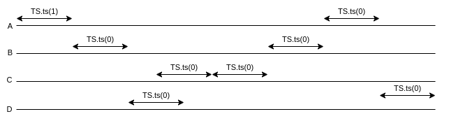

# TP4

## Exercice 1

**Que se passe-t- il si on réalise l’écriture en effaçant d’abord l’écriture précédente ?**

...

**Que se passe-t-il si on réalise l’écriture en écrivant d’abord la nouvelle valeur puis en effaçant ensuite l’écriture précédente ?**

On suppose que la lecture du nombre intervient entre les deux étapes de l'écriture du nouveau nombre.

La lecture parcourant le tableau de gauche à droite et s'arrêtant à la première valeur lue, on distingue deux cas:
- Le nouveau nombre écrit est plus petit que l'ancienne valeur
- Le nouveau nombre est plus grand que l'ancienne valeur

Si le nouveau nombre est plus petit, la nouvelle valeur sera lue.

Si le nouveau nombre est plus grand, l'ancienne valeur sera lue.

**En déduire qu’il ne faut pas toujours effacer les précédentes écritures. Comment réalise-t-on une
écriture ?**

...

**Implémenter la classe RegInt en utilisant un tableau de AtomicBoolean.**

...

## Exercice 2

**Donner un exemple d’exécution de 4 threads partageant un objet TS et faisant chacune 2 appels a
ts() de cet objet.**



**A l’aide de synchronized donnez une implémentation linéarisable de cet objet.**

```java
public class SynchronizedTS {

	private int value;
	
	public SynchronizedTS() {
		value = 1;
	}
	
	public synchronized int ts() {
		
		if(value == 1) {
			value = 0;
			return 1;
		}	
		return 0;
	}
}
```

**En utilisant un AtomicBoolean du package java.util.concurrent.atomic, implémenter un objet TS.**

```java
public class AtomicBooleanTS {
	
	AtomicBoolean bool;
	
	public AtomicBooleanTS() {
		bool = new AtomicBoolean(true);
	}
	
	public int ts() {
		
		if(bool.compareAndSet(true, false)) {
			return 1;
		}
		
		return 0;
	}
}
```

**En utilisant un AtomicInteger du package java.util.concurrent.atomic, implémenter un objet TS.**
```java
public class AtomicIntegerTS {

	AtomicInteger atint;
	
	public AtomicIntegerTS() {
		atint = new AtomicInteger(1);
	}
	
	public int ts() {
		
		if(atint.compareAndSet(1, 0)) {
			return 1;
		}
		
		return 0;
	}
}
```

## Exercice 3

**Donner un exemple d’exécution de 4 threads partageant un objet compteur et faisant chacune 2
appels add() de cet objet.**

...

**Cette première implémentation est-elle linéarisable ?**

Non, car il n'existe aucun mécanisme permettant d'assurer que l'appel à add retournera une valeur cohérente.

**Cette seconde implémentation est-elle linéarisable ?**

Oui, car les différentes implémentations de TS permettent d'assurer la linéarisabilité de l'exécution.
