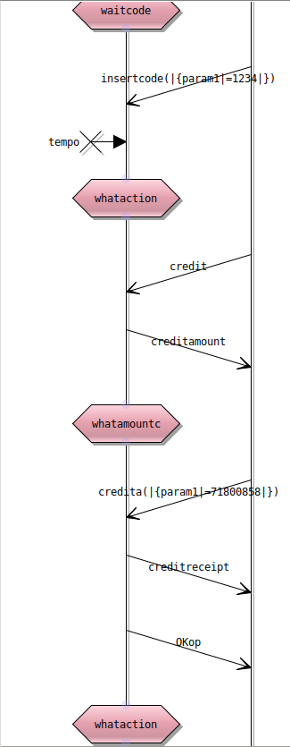
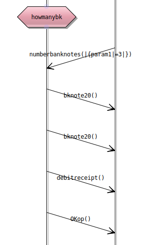
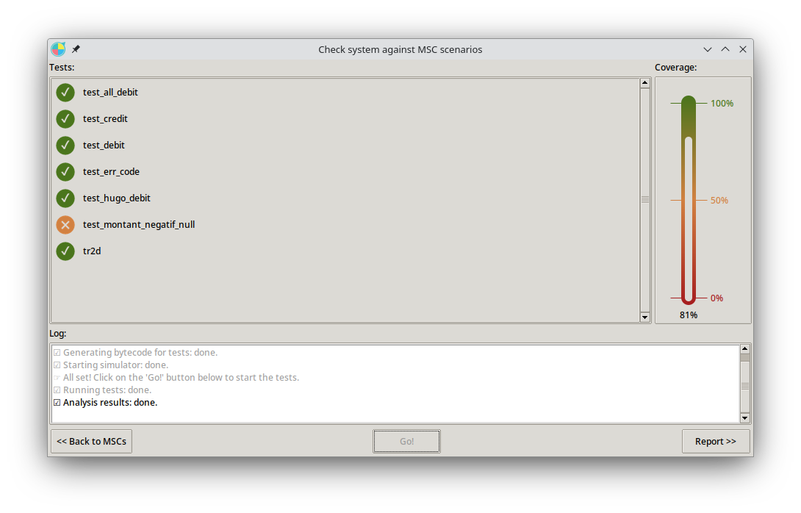
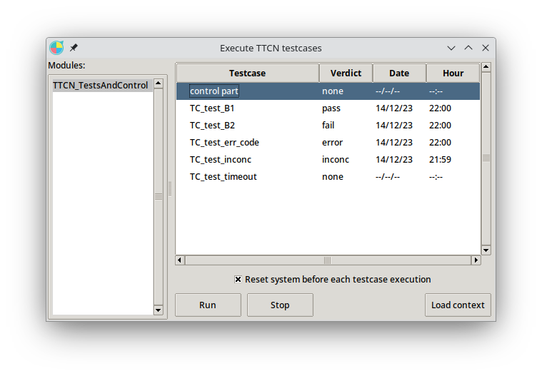

**Pénom, Nom :** Matthieu, Le Franc

**Numéro étudiant :** 71800858

**Email :** matthieu.le-franc@etu.u-paris.fr

# TP SDL

## 1/. MODELISATION

*Semaine 1 :*

**a).**

**Creditproc :**

- Si le montant renseigné est strictement supérieur à zéro :
    - on incrémente le compte du montant 
    - on envoie l'output
- Sinon, on ne fait rien

**Debitproc :**

- Si nbkn est strictement suprérieur à zéro :
    - Si n = nbkn 
        - on débite le compte du montant
        - on envoie l'output
    - Sinon on incrémente n, on va dans le message associé à la valeur de d puis on retourne à l'évaluation de n
- Sinon, on ne fait rien

**b). Séquences de test :** ``Couverture : 79%``


- *test_credit (test UIO) :* On test la procédure de credit du compte avec comme montant : mon numéro étudiant. Après avoir inséré la carte et le code, on effectue un crédit, le système nous demande un montant qui est ensuite crédité sur le compte et nous renvoie un **OKop** avant de retourner vers **whataction**.


- *test_debit :* On test la procédure de débit du compte avec comme nombre de billet : mon numéro étudiant modulo 50
- *test_debit_all :* On test le débit pour toutes les valeurs de billets possibles. Ainsi, on s'assure que toutes les sorties prévues dans la spécifications sont bien couvertes.
- *test_montant_negatif_null :* On test le credit d'un montant négatif. Avec ma spécification, on s'attend à ce qu'aucun crédit ne soit réalisé et qu'on sorte de la procédure.
- *test_err_code :* On test une fois le renseignement d'un code de carte erroné, puis le code de carte valide.
- *test_cancel_op :* On test l'annulation d'une opération.

## 2/. VERIFICATION DE LA SPECIFICATION

**a). Récupérer une trace MSC d'un.e camarade et faire un "check" de cette trace sur votre spécification, que constatez-vous? pourquoi?** 


J'ai importé la trace MSC d'un camarade (*test_camarade*) comportant des tests de débits. Le scénario de test obtient un verdict pass. Ma spécification **debitproc** couvre un maximum de cas possibles dont ceux probablement testé par la trace importée.

*Semaine 2 :*

**b). Récupérer la trace MSC que je vous fournis (tr3vFAIL), faire un nouveau check avec seulement cette trace. Que constatez-vous? pourquoi?**


Check effectué avec seulement la trace *tr3vFAIL* : le test fail et la couverture est de 41%. *tr3vFail* obtient un verdict fail car on y demande à un moment 3 billets de 20 et on s'attend à en recevoir 2. Certainement la spécification où la trace a été enregistrée qui pour 3 billets demandé en retourne 2.



**c). Refaire un check en ajoutant ma trace à vos traces. Que constatez-vous? pourquoi ?**


Mes traces passent le check, mais la trace *tr3vFAIL* ne passe toujours pas. La couverture augmente, elle est maintenant de  81%.

**d). Je vous fournis une nouvelle spécification du DAB, nommée MISD2019SOLUTION_FAIL, qui contient déjà une trace MSC (tr2d). Refaire un Check en y ajoutant toutes les traces précédentes. Que constatez-vous?**



Toutes mes traces passent mise à part : *test_montant_negatif_null*. Cela est normal, dans ma spécification de debitproc, je vérifie que le montant demandé n'est pas négatif et, si tel est le cas, je ne fais rien. Or, dans la spécification fournie ici pour debitproc, cette vérification n'est pas faite. Ma trace *test_montant_negatif_null* test un cas qui n'est pas prévu dans la spécification fournie.

**A partir de (d), cliquer sur 'Actions' à droite de la fenêtre de vérification et générer les TTCN pour tous ('ALL') les scenarios. Interpréter les résultats obtenus visibles dans le fichier TTCN_TestsAndControl.ttcn3.**

Dans le fichier ```TTCN_TestsAndControl.ttcn3```, on observer différentes instructions du test comme par exemple :
- *altstep RTDS_fail()* : pour gérer une situation d'échec. Si un message est reçu sur cardchan, l'étape déclenche un échec avec le message "Fail in default altstep!" et arrête l'exécution.


- Les cas de test (testcase) : avec chaque série d'interactions
- Les messages envoyés et reçus comme par exemple ``debit_tr2dMSG3`` qui représente un types d'action dans le scénario de test.

## 3/. SCRIPTS TTCN3

*Semaine 3 & 4 :*



**a). Ecrire un Test Case TTCN3 (tous les TC seront insérés dans le même fichier TTCN_TestsAndControl.ttcn3) permettant de prouver ce comportement B1 (dans tous les cas) dans SPEC3 ==> verdict pass**

Le test case *test_B1* est réalisé dans la spécification **MISD2019BASIS** (on demande 2 billets de 10 et on reçoit 2 billets de 10). En important dans **MISD2019SPEC3** la trace MSC associée, on obtient bien un verdict pass.

**b). Ecrire un Test Case TTCN3 menant au verdict fail du comportement B2**

On génère la trace pour le *test_B2* dans la spécification **MISD2019BASIS** (on demande un billet de 50 et on reçoit bien ce billet de 50). Ici, en l'important dans la spécification **MISD2019SPEC3**, on obtient un verdict fail car on reçoit un billet de 20.

**c). Ecrire un Test Case menant à un verdict inconc.**

On génère une trace testant un crédit : *test_inconc*. Dans le préambule, on introduit une erreur au niveau du code, ce qui mène à un état où le test ne peut continuer jusqu'à la procédure de crédit.

J'ai défini un verdict inconc dans le TTCN_TestsAndControl.ttcn3 qui est appelé lorsque ce cas de figure arrive.


**d). Obtenir une exécution du TTCN3 menant aux autres verdicts none et error,  résultats que vous justifierez et interpréterez**

- *TC_test_timeout* : après avoir inséré la carte et n'ayant pas renseigné de code avant la fin du temps imparti, on obtient un verdict none car le temps est dépassé sans qu'une action ait été effectuée.

- *TC_test_err_code* : obtient un verdict error car on entre un code de carte erroné et on ne peut pas réessayer.

**e). Dans SPEC3, 3 fautes (de type différents) ont été insérées (en comparant avec la spécification et les besoins initiaux du système), à vous de les détecter à l'aide de Test Cases TTCN3 bien définis.**

- première faute : dans la spec BASIS on permet à l'utilisateur de faire une erreur de code et de réessayer avant de l'éjecter alors que dans SPEC3 on éjecte directement après la première erreur de code. Situation mise en valeur avec le test case *test_err_code*.
- deuxième faute : après avoir fait un ``cancelop`` la condition est owait4confcancel dans la SPEC3 alors que dans la spec BASIS on attend avec *wait4confcancel*.
- troisième faute : après avoir demandé un credit, et au retour de la task creditproc(amountcredit), on a un output ``OKop`` dans la spec BASIS alors que dans SPEC3 on ne l'a pas.
