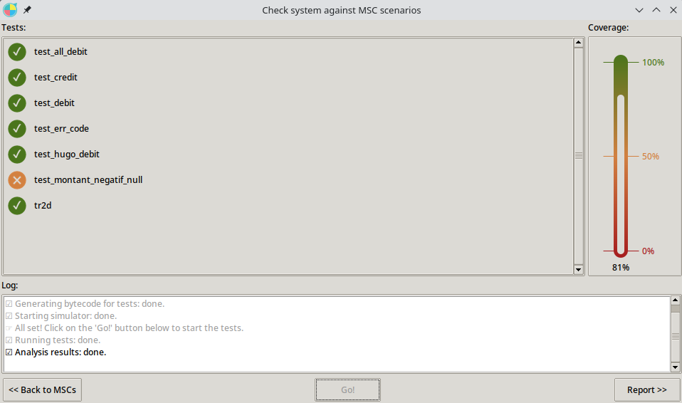

# TP SDL

## 1/. MODELISATION

## 2/. VERIFICATION DE LA SPECIFICATION

**a). Récupérer une trace MSC d'un.e camarade et faire un
"check" de cette trace sur votre spécification, que
constatez-vous? pourquoi?** 

Je ne constate pas de différences particulières entre la trace MSC de mon camarade et la mienne. Les deux passent le check.

**b). Récupérer la trace MSC que je vous fournis
(tr3vFAIL), faire un nouveau check avec seulement
cette trace. Que constatez-vous? pourquoi?**

Check effectué avec seulement la trace *tr3vFAIL* : le test fail, comme son nom pouvait le laisser penser, et la couverture est de 41%.
fail parce que demande 3 ou 2 et reçoit 2 ou 3

**c). Refaire un check en ajoutant ma trace à vos traces.
Que constatez-vous? pourquoi ?**

Mes traces passent le check, mais la trace *tr3vFAIL* ne passe toujours pas. La couverture est de 76%, soit la même couverture que pour mes traces seules.

**d). Je vous fournis une nouvelle spécification du DAB, nommée MISD2019SOLUTION_FAIL, qui contient déjà une
trace MSC (tr2d). Refaire un Check en y
ajoutant toutes les traces précédentes. Que
constatez-vous?**

Toutes mes traces passent à part mon test *test_montant_negatif_null*. Cela est normal, dans ma spécification de debitproc, je vérifie que le montant demandé est n'est pas négatif et, si tel est le cas, je ne fais rien. Or, dans la spécification fournie pour debitproc, cette vérification n'est pas faite.   

## 3/. SCRIPTS TTCN3

**1). Ecrire un Test Case TTCN3 (tous les TC seront insérés dans le même fichier TTCN_TestsAndControl.ttcn3)
permettant de prouver ce comportement B1 (dans tous les cas) dans SPEC3 ==> verdict pass**

Le test case pour B1 obtient un pass,
