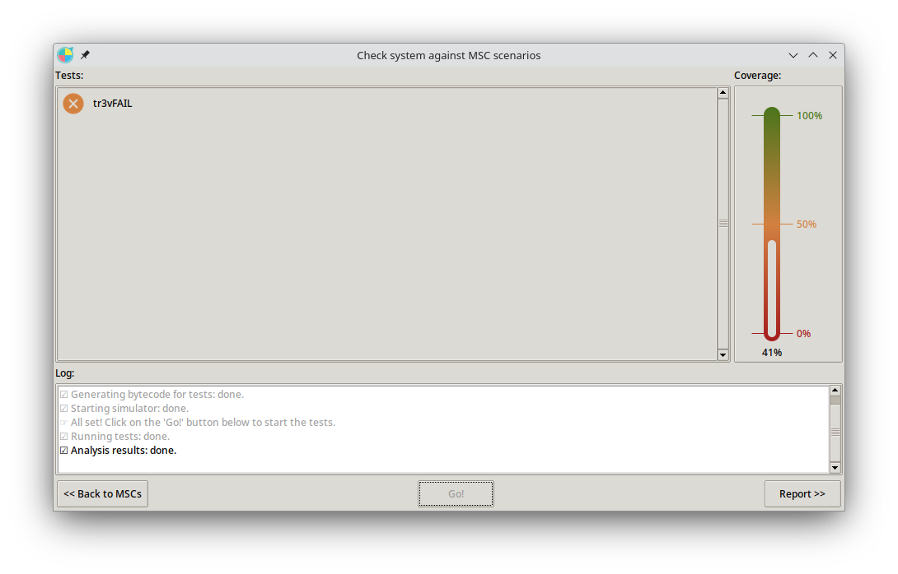
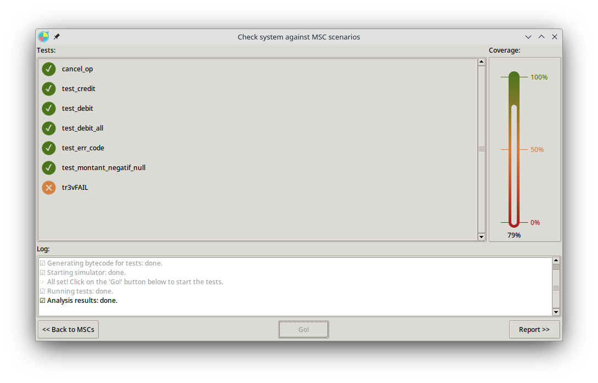
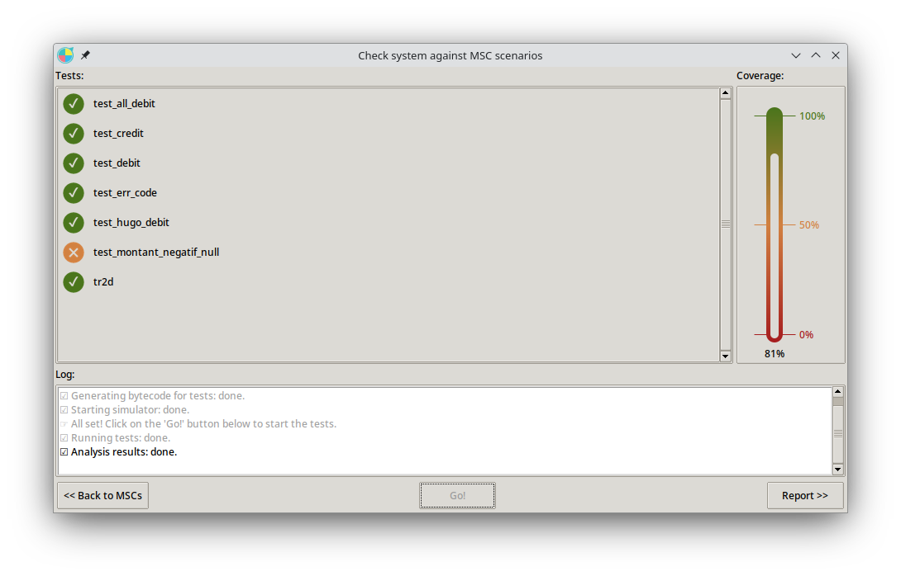
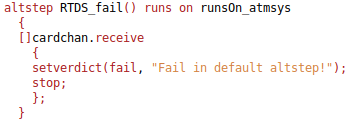
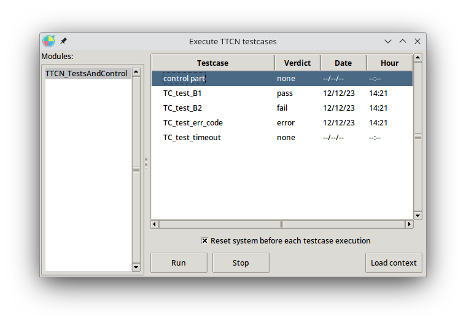

# TP SDL

## 1/. MODELISATION

**Creditproc :**
- Si le montant renseigné est strictement supérieur à zéro :
    - on incrémente le compte du montant 
    - on envoie l'output
- Sinon, on ne fait rien

**Debitproc :**
- Si nbkn est strictement suprérieur à zéro :
    - Si n = nbkn 
        - on débite le compte du montant
        - on envoie l'output
    - Sinon on incrémente n, on va dans le message associé à la valeur de d et on retourne à l'évaluation de n
- Sinon, on ne fait rien

**Séquences de test :**
    - *test_credit :* On test la procédure de credit du compte avec comme montant : mon numéro étudiant
    - *test_debit :* On test la procédure de débit du compte avec comme nombre de billet : mon étudiant modulo 50
    - *test_debit_all :* On test le débit pour toutes les valeurs de billets possibles
    - *test_montant_negatif_null :* On test le credit d'un montant négatif
    - *test_err_code :* On test de se tromper une fois en renseignant son code puis de donner un bon code
    - *test_cancel_op :* On est d'annuler une opération

Couverture : 79%


## 2/. VERIFICATION DE LA SPECIFICATION

**a). Récupérer une trace MSC d'un.e camarade et faire un "check" de cette trace sur votre spécification, que constatez-vous? pourquoi?** 

J'ai importé la trace MSC d'un camarade (*test_camarade*) comportant des test de débit. Il y test des débits pour plusieurs valeurs plus ou moins grande. Ce scénario de test obtient un verdict pass. Ma spécification **debitproc** couvre plusieurs cas possibles dont ceux testés par la trace importée.


**b). Récupérer la trace MSC que je vous fournis (tr3vFAIL), faire un nouveau check avec seulement cette trace. Que constatez-vous? pourquoi?**

Check effectué avec seulement la trace *tr3vFAIL* : le test fail et la couverture est de 41%. *tr3vFail* ne pass pas car on demande 3 billets de 20 mais on en reçoit que 2.



**c). Refaire un check en ajoutant ma trace à vos traces. Que constatez-vous? pourquoi ?**

Mes traces passent le check, mais la trace *tr3vFAIL* ne passe toujours pas. La couverture est de 79%, soit la même couverture que pour mes traces seules.



**d). Je vous fournis une nouvelle spécification du DAB, nommée MISD2019SOLUTION_FAIL, qui contient déjà une trace MSC (tr2d). Refaire un Check en y ajoutant toutes les traces précédentes. Que constatez-vous?**



Toutes mes traces passent à part mon test : *test_montant_negatif_null*. Cela est normal, dans ma spécification de debitproc, je vérifie que le montant demandé n'est pas négatif et, si tel est le cas, je ne fais rien. Or, dans la spécification fournie ici pour debitproc, cette vérification n'est pas faite.

Un comportement dans la spécification **MP72022SOLUTION_FAIL** est particulier : peu importe le nombre de billets de 10 demandé, on obtiendra toujours 2 billets de 10 en sortie. 
La trace tr2d obtient un verdict pass car le test a été créé dans la spécification **MP72022SOLUTION_FAIL** mais si on importait une trace réalisant ce test généré dans **MISD2019BASIS**, on obtiendrait un verdict fail.

Dans ma trace *test_debit_all* importé de **MISD2019BASIS**, je demande plusieurs valeurs de billets dont 2 billets de 10 (exclusivement 2 pour les billets de 10). C'est pour cela que j'obtiens un verdict pass avec cette trace importée dans la spec **MP72022SOLUTION_FAIL** mais si j'avais tenté de demander par exemple 3 billets de 10, je n'aurais pas eu un verdict pass avec cette trace.

**A partir de (d), cliquer sur 'Actions' à droite de la fenêtre de vérification et générer l car le comportement es TTCN pour tous ('ALL') les scenarios. Interpréter les résultats obtenus visibles dans le fichier TTCN_TestsAndControl.ttcn3.**

Dans le fichier ```TTCN_TestsAndControl.ttcn3```, on peut voir plusieurs instructions comme :
- *altstep RTDS_fail()* : pour gérer une situation d'échec. Si un message est reçu sur cardchan, l'étape déclenche un échec avec le message "Fail in default altstep!" et arrête l'exécution.



- Les cas de test (testcase) : avec chaque série d'interactions
- Les messages envoyés et reçus comme par exemple ``debit_tr2dMSG3`` qui représente un types d'action dans le scénario de test.

## 3/. SCRIPTS TTCN3



**a). Ecrire un Test Case TTCN3 (tous les TC seront insérés dans le même fichier TTCN_TestsAndControl.ttcn3) permettant de prouver ce comportement B1 (dans tous les cas) dans SPEC3 ==> verdict pass**

Le test case *test_B1* est réalisé dans la spécification **MISD2019BASIS** (on demande 2 billets de 10 et on reçoit 2 billets de 10). En important dans **MISD2019SPEC3** la trace MSC associée, on obtient bien un verdict pass.

**b). Ecrire un Test Case TTCN3 menant au verdict fail du comportement B2**

On génère la trace pour le *test_B2* dans la spécification **MISD2019BASIS** (on demande un billet de 50 et on reçoit bien ce billet de 50). Ici, en l'important dans la spécification **MISD2019SPEC3**, on obtient un verdict fail car on reçoit un billet de 20.

**d). Obtenir une exécution du TTCN3 menant aux autres verdicts none et error,  résultats que vous justifierez et interpréterez**

- *TC_test_timeout* : obtient un verdict none car le temps est dépassé sans qu'une action ait été effectuée.

- *TC_test_err_code* : obtient un verdict error car on entre un code de carte erroné et on ne peut pas réessayer.

**e). Dans SPEC3, 3 fautes (de type différents) ont été insérées (en comparant avec la spécification et les besoins initiaux du système), à vous de les détecter à l'aide de Test Cases TTCN3 bien définis.**

- première faute : dans la spec BASIS on permet à l'utilisateur de faire une erreur de code et de réessayer avant de l'éjecter alors que dans SPEC3 on éjecte directement après la première erreur de code. Situation mise en valeur avec le test case *test_err_code*.
- deuxième faute : après avoir fait un ``cancelop`` la condition est owait4confcancel dans la SPEC3 alors que dans la spec BASIS on attend avec *wait4confcancel*.
- troisième faute : après avoir demandé un credit, et au retour de la task creditproc(amountcredit), on a un output ``OKop`` dans la spec BASIS alors que dans SPEC3 on ne l'a pas.
